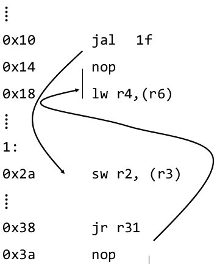

# Processes and Threads Implementation

## MIPS R3000

MIPS uses a load-and-store architecture. There are no instructions that operate on memory except for load and store ones.

Simple load/stores to/from memory from/to registers:

* store word: `sq r4 (r5)` stores the contents of r4 in memory using the address contained in register r5
* load word: `lw r3 (r7)` loads the contents of memory into r3 using the address contained in r7. There is a delay of one instruction after load before data is available in the destination register. There **must always** be an instruction between a load from memory and the subsequent use of the register.
* other load/store instructions: `lw sw lb sb lh sh`

Arithmetic and logical operations are register-to-register operations. There are no arithmetic operations in memory.

Examples:

``` mips
add r3, r2, r1  # r3 = r2 + r1

# other instructions
add # add
sub # subtract
and
or
xor
sll # shift left logical
srl # shift right logical
```

All instructions are encoded in 32-bit. Some instructions have _immediate_ operands. Immediate values are constants encoded in the instruction itself and are of 16-bit value. 

Examples:

``` mips
addi r2, r1, 2048   # r2 = r1 +2-48
li   r2, 1234       # r2 = 1234
```

Examples: `a = a + 1` in MIPS

``` mips
lw  r4, 32(r29)     # r29 = stack pointer, store value of a in r4
li  r5, 1
add r4, r4, r5      # r4 = r4 + 1
sw  r4, 32(r29)     # store result back into a
```

### MIPS Registers

User-mode accessible registers:

* 32 general purpose registers
  * `r0` is hardwired to `0`
  * `r31` is the **link** register for `jal` instruction, which stores the return address for when a `jal` completes
* `HI`/`LO` - `2 * 32-bits` for multiply and divide
* `PC` - the program counter. It is not directly visible and is modified implicitly by jump and branch instructions

### Branching and Jumping

Branching and jumping have **branch delay slot**. The instruction following a branch or jump is **always executed prior**  to the destination.

``` mips
    li  r2, 1       # r2 = 1
    sw  r0, (r3)    # r3 = 0
    j   1f          # execute next instruction, then jump to 1:
    li  r2, 2       # r2 = 2
    li  r2, 3       # r2 = 3

1:  sw r2, (r3)     # store value of r2 into memory address at r3, which is 2
```

This is because MIPS uses RISC architecture; a 5 stage pipeline, where instructions are partially through a pipeline prior to `jump` having an effect


The `jal` (jump and link) instruction is used to implement function calls. When this happens `r23 = PC +8`. This is where the return address is stored when we return from the function call.



### Compiler Register Conventions

There are 32 registers in MIPS and they all have some associations:

| Reg#      | Name      | Used for                                                  |
| ---       | ---       | ---                                                       |
| `0`       | `zero`    | Always returns 0. It's value is unchangeable              |
| `1`       | `at`      | **assembly-temporary** Reserved for use by the assembler  |
| `2-3`     | `v0-v1`   | Value (except `FP`) returned by subroutine                |
| `4-7 `    | `a0-a3`   | (**arguments**) First four parameters for a subroutine    |
| `8-15`    | `t0-t7`   | (**temporaries**) subroutines may use without saving      |
| `16-23`   | `s0-s7`   | Subroutine **register variables**: a subroutine which will write in one of these must save the old value and restore it before it exits, so the _calling_ routine sees their value preserved |
| `24-25`   | `t8-t9`   | (**temporaries**) subroutines may use without saving      |
| `26-27`   | `k0-k1`   | Reserved for use by interrupt/trap handler - may change under your feet |
| `28`      | `gp`      | **global pointer** - some runtime systems maintain this to give easy access to some `static` or `extern` variables |
| `29`      | `sp`      | **stack pointer**                                         |
| `30`      | `s8/fp`   | 9th **register variable**. Subroutines which need one can use this pointer as a **frame pointer** |
| `31`      | `ra`      | Return address for subroutine                             |

Example of a factorial function in MIPS


### Function Stack Frames

Each function call allocated a new stack frame for local variables, the return address, previous frame pointer etc.  
The frame pointer points to the **start** of the current stack frame  
The stack pointer points to the **end** of the current stack frame

Example: assume `f1()` calls `f2()` which calls `f3()`


MIPS' calling convention for `gcc` has space reserved for arguments 1 to 4


Example:


## The Process Model
