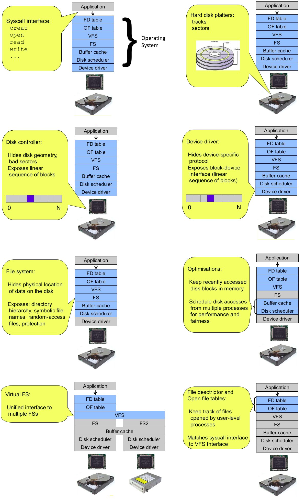
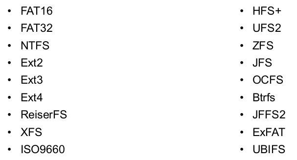
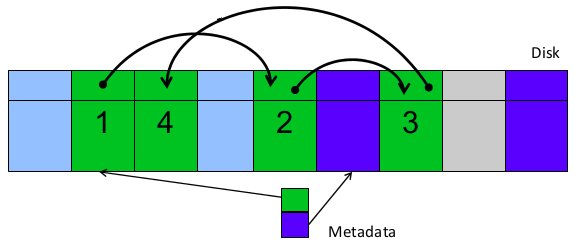
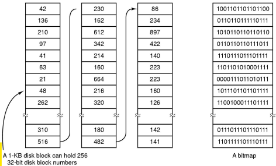

# File System Internals

UNIX storage stack:

Some popular file systems:

Why are there so many?

* Different physical nature of storage devices
  * Ext3 is optimised for magnetic disks
  * JFFS2 is optimised for flash memory devices
  * ISO9660 is optimised for CD-ROM
* Different storage capacities
  * FAT16 does not support drives >2GB
  * FAT32 becomes inefficient on drives >32GB
  * ZFS, Btrfs is designed to scale to multi-TB disk arrays
* Different CPU and memory requirements
  * FAT16 is not suitable for modern PCs but is a good fit for many embedded devices
* Proprietary standards
  * NTFS may be a nice file system, but its specification is closed

## File Systems for Magnetic Disks

We will focus on file systems for magnetic disks and will make the following assumptions:

* seek time is ~15ms in the worst case
* rotational delay is 8ms in the worst case for a 7200rpm drive

For comparison, disk-to-buffer transfer speed of a modern drive is ~10μs per 4K block.  
We can see that mechanical delays introduce significant delays relative to the actual cost of reading a block off a disk. In order to improve this we want to keep blocks that are likely to be accessed together close to each other.

### Implementing a file system

The file system must map symbolic file names into a collection of block addresses. It must keep track of 

* which blocks belong to which file
* in which order the blocks form the file
* which blocks are free for allocation

Given a logical region of a file, the file system must track the corresponding block(s) on disk. This is stored in the file system metadata.

### File Allocation Methods

A file is divided into "blocks" - the unit of transfer to storage. Given the logical blocks of a file, we need a way to decide how and where to put the blocks on a disk.

### External and Internal Fragmentation

**External fragmentation** is the space wasted **external** to the allocated memory regions. Memory space exists to satisfy a request, but it is unusable as it is not contiguous.

**Internal fragmentation** is the space wasted **internal** to the allocated memory regions. Allocated memory may be slightly larger than requested memory; this size difference is wasted memory internal to the partition.

### Contiguous Allocation

In **contiguous allocation**, a file occupies a contiguous series of blocks on the disk.  

Advantages:

* easy bookkeeping (need to keep track of the starting block and length of the file)
* increases performance for sequential operations

Disadvantages:

* need the maximum file sixe for the file at the time of creation
* as many files are deleted, free space becomes divided into many small chunks (external fragmentation)

Examples: ISO 9660 (CDROM FS)

### Dynamic Allocation Strategies

In **dynamic allocation** strategies, disk space is allocated in portions as needed. The allocation occurs in **fixed-sized** blocks.

Advantages:

* no external fragmentation
* does not require pre-allocating disk space

Disadvantages:

* partially filled blocks (internal fragmentation)
* file blocks are scattered across the disk
* complex metadata management (maintain the collection of blocks for each file)

#### Linked List Allocation

In a **linked list** allocation, each block contains a pointer to the next block in the chain. Free blocks are also linked in the chain.

Advantages:

* only single metadata entry per file
* best for sequential files

Disadvantages:

* poor for random access
* blocks end up scattered across the disk due to free list eventually being randomised

#### File Allocation Table (FAT)

The **File Allocation Table (FAT)** method keeps a map of the entire file system in a separate table. A table entry contains the number of the next block of the file. The last block in the file and empty blocks are marked using reserved values.

The table is stored on the disk and is replicated in memory. This allows random access to be fast (following the in-memory disk)

Disadvantages:

* requires a lot of memory for large disks  
`200GB = 200*10^6 * 1K blocks = 200*10^6 FAT entries = 800MB`, which is large back when we didn't have lot of memory
* free block lookup is slow as it searches for a free entry in the table

Example of file allocation table disk layout:

Note that there are two copies of FAT in case one of them every fails.

### Inode-based File System Structure

The idea behind an **inode-based** file system structure is to have a separate table (index-node or i-node) for each file. We only keep the table for open files in memory, allowing fast random access. It is the most popular file system structure today.

i-nodes occupy one or several disk areas. In the example below, a portion of the hard disk is reserved for storing i-nodes.

i-nodes  are allocated dynamically, hence free-space management is required for i-nodes.  
We use fix-sized i-nodes to simplify dynamic allocation. The i-node contains entries for file attributes, references to blocks of where file blocks are located and reserve the last i-node entry for a pointer (a block number) to an extension i-node. The extension i-node will contain block numbers for higher offsets of the file

A diagram of i-node entries:

Free space management can be approached two ways:

1. a linked list of free blocks in free blocks on disk
2. keeping bitmaps of free blocks and free i-nodes on disks

In approach 1, we'll have a list of all unallocated blocks. Background jobs can re-order the list for better contiguity.  
We store in i-node entries other free blocks with the last entry pointing to the next block containing a list of free blocks. This does not reduce the disk capacity of free blocks. Only one block of pointers needs to be kept in main memory (that is the head of the list).

When we need to use free blocks, we go through entries of free blocks in the head of the free block list. When we reach the final entry, the head of the list becomes the next block containing a free block entries and we can use the current block as a free block.

In approach 2, individual bits in a bit vector flags used and free blocks.  
A 16GB disk with 512 byte blocks will have a 4MB table.  
This may be too large to hold in main memory and becomes expensive to search (although optimisations are possible; e.g. a two level table)  
Concentrating (de)allocation in a portion of the bitmap has the desirable effect of concentrating access. It also becomes simple to find contiguous free space.

### Implementing directories

Directories are stored like normal files expect the operating system does not let you access it directly. Directory entries are contained inside data blocks.

The file system assigns special meaning to the content of these files;

* a directory file is a list of directory entries
* a directory entry contains file name, attributes and the file i-node number. This maps a human-oriented file-name to a system oriented name

#### Directory Entries

Directory entries can be fixed-sized or variable-sized.

**Fixed-sized** directory entries are either too small (e.g; DOS has an 8 character name and 3 character suffix) or waste too much space (e.g. 255 characters per file name).  
**Variable-sized** directory entries are dynamically allocated within the directory and can cause external fragmentation when these entries are freed. We can reduce external fragmentation by loading entries into RAM and then loading it back.

#### Searching Directory Listings

We can located files in a directory by using:

* a linear scan - implementing a directory cache in software can speed this up
* hash lookups
* B-tree (containing 100s of 1000s of entries)

#### Storing File Attributes

(a) disk addresses and attributes in a directory entry (e.g. FAT)  
(b) directory in which each entry just refers to an i-node (e.g. UNIX)

## Trade-off in File System Blocks

File systems deal with 2 types of blocks; disk blocks or sectors (usually 512 bytes). File systems can have blocks the size of `512 * 2^N` where we would like `N` to be optimal.

Larger blocks require less file system metadata, while smaller blocks waste less disk space (less internal fragmentation).  
Sequential access is easier for larger block sizes as fewer I/O operations are required.  
For random access, the larger the block size, the more unrelated data we get loaded. Spatial locality of access is what improves the situation.

Choosing an appropriate block size is a compromise.

