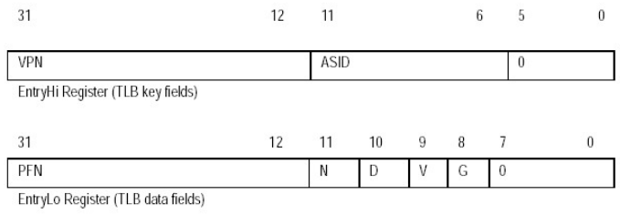
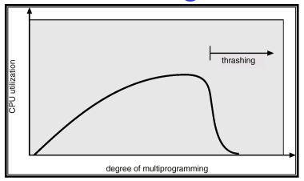
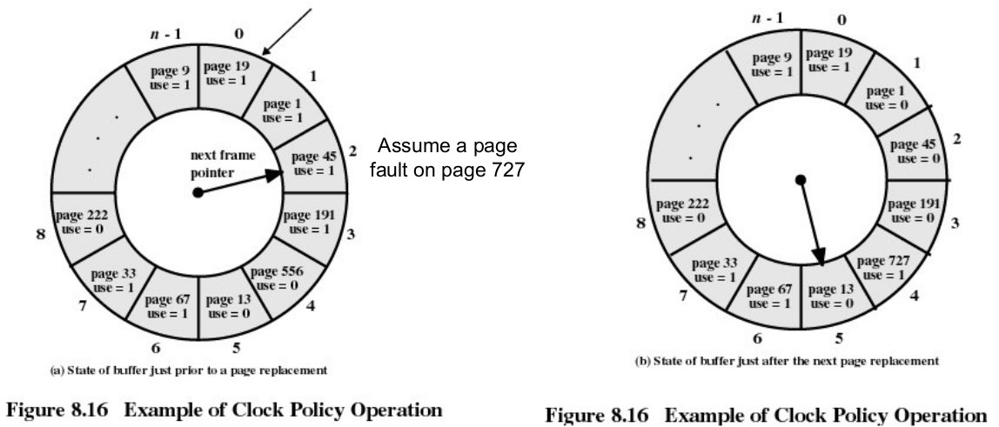

# Virtual Memory ctd.

## TLB Recap

TLB may or may not be under the operating system's control

* Hardware-loaded TLB - on a miss, hardware performs a page table lookup and reloads the TLB; e.g. Pentium
* Software-loaded TLB - on a miss, hardware generates a TLB miss exception, and exception handler reloads the TLB; e.g. MIPS

Even if the TLB is filled by software, it is still a hardware-based translator

## Amdahl's Law

**Amdahl's law** states that overall performance improvement is limited by the fraction of time an enhancement can be used.


So the goal is to **make common cases FAST**

## MIPS R3000 TLB Handling

TLB refill is handled by software (an exception handler)

TLB refill exceptions are accessing `kuseg` are expected to be frequent so the CPU is optimised for handling `kuseg` TLB refills by having a special exception handler just for TLB refills


The special exception vector is optimised for TLB refills since it:

* does not need to check the exception type (since it has its own handler)
* does not need to save any registers; it uses a specialised assembly routine that only uses `k0` and `k1`
* does not check if the page table entry exists; assumes a virtual linear array (see extended OS if interested)

With careful data structure choice, the exception handler can be very fast

An example routine:

``` assembly
mfc0  k1, C0_CONTEXT
mfc0  k0, C0_EPC # mfc0 delay slot

lw    k1, 0(k0) # may double fault (k0 = orig EPC)
nop
mtc0  k1, Co_ENTRYLO
nop
tlbwr
jr    k0
rfe
```

MIPS virtual memory related exceptions:

* TLB refill - handled via special exception vector; needs to be very fast
* others - handled by the general exception vector; can be slower as they are mostly caused by an error, or non-resident page
    * TLB Mod- TLB modify exception; attempt to write to a read-only page
    * TLB Load- attempt to load from a page with an invalid translation
    * TLB Store- attempt to store to a page with an invalid translation

We never optimise for errors, and page-loads from disk. They dominate the fault resolution cost (see [Amdahl's law](#Amdahl's-Law))

### c0 Registers

* `c0_EPC` - stores the address of where to restart after the exception
* `c0_status` - stores kernel/user mode bits; interrupt control
* `c0_cause` - stores what caused the exception
* `c0_badvaddr` - stores the address of the fault

If `c0_EPC` and `c0_badvaddr` are the **same** then the page for the next instruction was not loaded  
If `c0_EPC` and `c0_badvaddr` are the **same** then it is likely to be an load/store failure

`c0` Registers are used to read and write individual TLB entries. Each TLB entry contains:

* `EntryHi` to match the page# and ASID
* `EntryLo` which contains the frame# and protection




MIPS' `c0` Registers:

* `N` for not cachable
* `D` for dirty (i.e write protect)
* `G` for gloabl (ignore ASID in lookup)
* `V` for valid bit

There are 64 TLB entries, and they are accessed via software through coprocessor 0 registers (`EntryHi`, `EntryLo`)

**MIPS TLB Translation**:  
You are given an address in format `0x????????` and address space (ASID) `0x00000200`  
The TLB has the format:

``` txt
         TLB
EntryHi     EntryLo
0x00028200  0x0063f400
0x00034200  0x001fc600
0x0005b200  0x002af200
0x0008a100  0x00145600
0x0005c100  0x006a8700
0x0001c200  0x00a97600
```

1. Find an `EntryHi`entry in the TLB where the first 5 bits match your virtual address (the first 5 bits represent the page number)
2. Check the ASID matches your given ASID (i.e the last 3 bits match)
3. Check the flag bits in the `EntryLo` mapping of the TLB (i.e the 6th bit)
    1. If the valid bit is **not** set, the mapping is **invalid**
    2. If the ASID does not match and the global bit is not set, the mapping is **invalid**
    3. Otherwise, the mapping is **valid**
4. If the mapping is valid, the physical address is the first 5 bits of `EntryLo` (the frame number) and the last 3 bits of your virtual address (the offset)

The `c0_Index` register is used as an index to TLB entries. Single TLB entries are manipulated/viewed through `EntryHi` and `EntryLo` registers. The index register specifies which TLb entry to change/view

Special TLB management instructions:

* `TLBR` for TLB read - `EntryHi` and `EntryLo` are loaded from the entry pointer by the index register
* `TLBP` for TLB probe - sets `EntryHi` to the entry you wish to match; index register is loaded with the index to the matching entry
* `TLBWR` - write `EntryHi` and `EntryLo` to a pseudo-random location in the TLB
* `TLBWI` - write `EntryHi` and `EntryLo` to the location in the TLB pointed to by the index register

Example of coprocessor 0 registers on a refill exception:

``` tct
c0.EPC           = PC
c0.cause.ExcCode = TLBL; if read fault
c0.cause.ExcCode = TLBS; if write fault
c0.BadVaddr      = faulting address
c0.EntryHi.VPN   = page number of faulting address
c0.status        = kernel mode, interrupts disabled
c0.PC            = 0x8000 000
```

### Outline of TLB Miss Handling

Software does: 

* lookup of page table entry corresponding to faulting address
* If found:
    * load `c0_EntryLo` with translation
    * load TLB with `TLBWR`instruction
    * return from exception
* else, page fault

The TLB entry (i.e. `c0_EntryLo`) can be (theoretically) created on the fly or stored completely in the right format in the page table (the latter being more efficient)

**OS/161 Refill handling**:  
After switching to the kernel stack, it simply calls the common exception handler

* stacks all registes
* can (and does) call `C` code
* unoptimised
* goal is ease of kernel programming, not efficiency

It does not have a page table. It uses the 64 TLB entries and then panics when it runs out. It only supports 256K user-level address space

## Demand Paging/Segmentation

With virtual memory, only parts of the program image need to be resident in memory for execution. We can transfer presently unused page/segments to disk and then reload non-resident pages/segments on **demand**

A **reload** is triggered by a page or segment fault. The faulting process is blocked and another is scheduled. When the page/segment is resident, the faulting process is restarted.  
This may require freeing up memory first, where we replace a current resident page/segment (the replacement "victim"). If the victim is unmodified ("clean") we can simply discard it. This is the reason for maintaining a "dirty" bit in the page table.

Why does demand paging/segmentation work?  
We know a program executes at full speed only when accessing the resident set. TLB misses and page/segment fault introduce delays of several microseconds.  
**Answer**:

* less physical memory is required per process and we can fit more processes in memory. This results in an improved chance of finding a runnable one.
* principle of locality

## Principle of Locality

It was observed that programs tend to reuse data and instructions they have recently used; 90/10 rule - _"A program spends 90% of its time in 10% of its code"_

We can exploit this _locality of refences_

An implication of locality is that we can reasonably **predict what instructions and data a program will use** in the near future **based on its accesses in the recent past**

Two different types of locality have been observed:

* **temporal locality** states that recently accessed items are likely to be accessed in the near future
* **spatial locality** states that items whose addresses are near one another tend to be referenced close together in time

Locality in a memory-reference patter for `gcc`


## Working Sets

The pages/segments required by an application in a time window (Δ) is called its memory **working set**

A working set is an approximation of a program's locality. If

* Δ is too small, it will not encompass entire locality
* Δ is too big, it will encompass several localities
* Δ = ∞, it will encompass the entire program

Δ's size is an **application specific trade-off**

The system should keep resident at least a process's working set. The process executes while it remains in its working set.

The working set tends to change gradually since we tend to only get a few page/segment faults during a time window. It is possible (but hard) to make intelligent guesses about which pieces will be needed in the future

In `gcc`'s memory reference pattern, the working set is the page numbers loaded at a point of execution time


## Thrashing

CPU utilisation tends to increase with the degree of multiprogramming (the number of processes in the system). _Higher degrees of multiprogramming means less memory available per process_.

Some process' working sets may no longer fit in RAM. This implies and increasing page fault rate. Eventually many processes have insufficient memory and can't find a runnable process. This results in decreased CPU utlisation, and the system being I/O limited. This is known as **thrashing**



Why does thrashing occur?  
Σ working set sizes > total physical memory size

In the presence of increasing page fault frequency and decreasing CPU utilisation:

1. suspend a few processes to reduce the degree of multiprogramming
2. resident pages of suspended processes will migrate to a backing store
3. more physical memory becomes available; less faults, faster process for runnable processes
4. resume suspended processes later when memory pressure eases

## Virtual Memory Management Policies

Operation and performance of VM systems is dependent on a number of policies:

* page table format (may be dictated by hardware); e.g multi-level, inverted/hashed
* page-size (may be dictated by hardware)
* fetch policy
* replacement policy
* resident set size; minimum allocation and local vs. global allocation
* page cleaning policy

### Page Size

Increasing page size:  
✓ decreases number of pages - reduces size of page tables  
✓ reduces TLB coverage - reduces number of TLB misses  
✓ increases swapping I/O throughput - small I/O are dominated by seek/rotation delays  
x increases internal fragmentation - reduces the adaptability to working set size  
x increases page fault latency - need to read more from disk before restarting process

The optimal page size is a (work-load dependent) trade-off

Generally, the working set size increases with the page size.

Processors and their page sizes:


Multiple page sizes provides flexibility to optimise the use of the TLB. For example, large page sizes can be used for code, while small page sizes can be used for thread stacks. Most operating systems support only a single page size, since it is difficult to deal with multiple page sizes

### Fetch Policy

**Fetch Policy** determines _when_ a page should be brought in to memory.

**_Demand paging_** only loads pages in response to page faults. There will be many page faults when a process first starts  
**_Pre-paging_** brings in more pages than needed at the moment. It will pre-fetch when the disk is idle. This improves I/O performance by reading in larger chunks. However, it wastes I/O bandwidth if the pre-fetched pages aren't used. It is especially bad if we eject pages in the working set in order to pre-fetch unused pages.

The pre-paging is difficult to get right in practice and demand paging is often used instead of it.

### Replacement Policy

Replacement policy decides which page to remove from the page table, when we need to load a non-resident page.

The page removed should be the page least likely to be referenced in the near future. Most policies attempt to predict the future based on past behaviour

Constraints:

* kernel code
* main kernel data structures
* I/O buffers
* performance-critical user-pages (e.g. for DBMS)

For the above the fram table has a **lock** (or **pinned**) bit

#### _Optimal_ Replacement Policy

The **_optimal_ replacement policy** tosses the page that won't be used for the longest time. However, this is **impossible** to implement. It is only good as a theoretical reference point. The closer a practical algorithm gets to _optimal_ the better

For example, we have the following reference string `1, 2, 3, 4, 1, 2, 5, 1, 2, 3, 4, 5` and can only load 4 frames at a time. The amount of page faults generated is 6.

#### FIFO Replacement Policy

**First-in, first-out (FIFO)** tosses the oldest page. It is easy to implement but the age of a page is not necessarily related to it usage.

For example, we have the following reference string `1, 2, 3, 4, 1, 2, 5, 1, 2, 3, 4, 5` and can only load 4 frames at a time. The amount of page faults generated is 10.

#### Least Recently Used (LRU)

**Least Recently Used (LRU)** tosses the least recently used page. It assumes that the page that has not been referenced for a long time is unlikely to be referenced in the near future. It works well if locality holds.

The implementation requires a time stamp to be kept for each page, which is updated **on every reference**. It is impossible to implement efficiently since it would require specialist hardware to update the time stamp for every single memory reference.

For example, we have the following reference string `1, 2, 3, 4, 1, 2, 5, 1, 2, 3, 4, 5` and can only load 4 frames at a time. The amount of page faults generated is 8.

#### Clock Page Replacement

The **clock policy** also called **second chance** employs a _usage_ or _reference_ bit in the frame table. A frame is set to `1` when the page is used. While scanning for a victim, reset all the reference bits to `0`. We toss the first page with a `0` reference bit.



How do we know when a page is referenced in software?  
We use the valid bit in the page table entry. When a page is mapped (valid bit set), set the "reference" bit. When resetting the reference bit, invalidate the page table entry. On a page fault, turn on the valid bit in the page table entry equates to turning on the reference bit. Thus, we simulate a reference bit in software.


#### Policy Performance

In terms of selecting the most appropriate replacement policy, they rank as follows

1. Optimal
2. LRU
3. Clock
4. FIFO

Note that there are other algorithms (Working Set, WSclock, Ageing, NFU, NRU)

### Resident Set Size

Resident set size concerns how many frames each process should have.

We can have a **fixed allocation**, which gives a process a fixed number of pages within which to execute. This isolates process memory usage from each other. When a page fault occurs, one of the pages of that process must be replaced. Achieving high utilisation is an issue here sine some processes have high fault rate while others use their full allocation.

We can also have **variable allocation**, where the number of pages allocated to a process varies over the lifetime of the process.  

There is **variable allocation with a global scope**. The operating system keeps a global list of free frames. A free frame is added to a resident set of a process when a page fault occurs. If there is no free frame, it replaces one from any process. It provides automatic balancing across the system but does not provide guarantees for important activities. This is the easiest and adopted by many operating systems.

There is also **variable allocation with a local scope**. This allocated the number of page frames to a new process based on 

* application type
* program request
* other criteria (e.g. priority)

When a page fault occurs, we select a page from among the resident set of the process that suffers the page fault. We will have to _re-evaluate allocation from time to time_

Our allocations will have to establish an "acceptable" page-fault rate.  
If the actual rate is too low, the process loses a frame  
If the actual rate is too high, the process gains a frame

### Cleaning Policy

It's been observed that clean pages are much cheaper to replace than dirty pages.

In **demand cleaning** a page is written out only when it has been selected for replacement. There is a  high latency between the decision to replace and availability of free frame.

In **precleaning**, pages are written out in batches (in the background, the _pagedaemon_). It increases the likelihood of replacing clean frames. This also overlaps I/O with the current activity.
