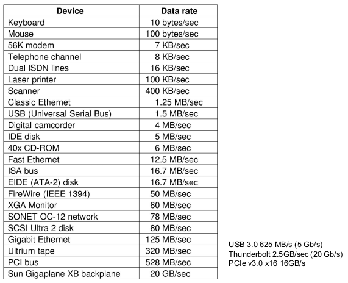
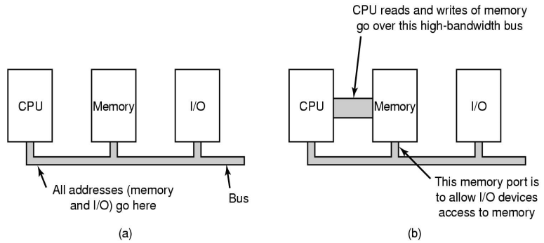
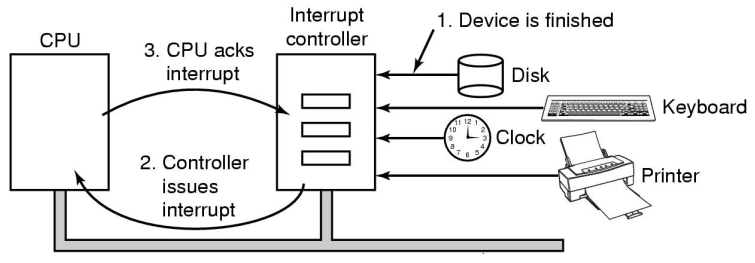

# I/O Management

There exists a large variety of I/O devices.

Many of them have different properties and they seem to require different interfaces to manipulate and mange them. We don't want a new interface for every device, but something uniform and efficient.

## Device Drivers

The logical position of device drivers is shown below.

Originally, **drivers** were compiled into the kernel (e.g. OS/161). Device installers were technicians and the number and types of devices rarely change.

Nowadays, they are **_dynamically_** loaded when needed (e.g. Linux modules). Typical users (device installers) can't build kernels. The number and types of devices vary greatly.

Drivers are classified into similar categories; **block** devices and **character** (stream of data) devices. The OS defines a standard (internal) interface to the different classes of devices; e.g. USB Human Input Device (HID) class specifications - human input devices follow a set of rules making it easier to design a standard interface

Some USB Device Classes:

The data rate may be in differences of several orders of magnitude between the data transfer rates  
Example:. assume 1000 cycles/byte I/O  
A keyboard needs a 10KHz processor to keep up  
A Gigabyte Ethernet needs a 100 GHz processor...

Some sample data rates:

A **device driver's** job is to translate requests through the device-independent standard interface (open, close, read, write) into appropriate sequences of commands (register manipulations) for the particular hardware.  
It initialises the hardware at boot time, and shuts it down cleanly at shutdown

After issuing the command to the device, the device either

* completes immediately and the driver simply returns to the caller or,
* the device must process the request and the driver usually blocks waiting for an I/O complete interrupt

Drivers are **_thread-safe (synchronised)_** as they can be called by another process while a process is already blocked in the driver.

### Device-Independent I/O Software

There is commonality between drivers of similar classes. We divide I/O software into device-dependent and device-independent I/O software.  
Device-independent software include:

* buffer or buffer-cache management
* TCP/IP stack
* managing access to dedicated devices
* error reporting

### Driver ⬄ Kernel Interface

A major issue is uniform interfaces to devices and the kernel

A **uniform device interface for kernel code** allows different devices to be used in the same way. There is no need to re-write the file-system to switch between SCSI, IDE or RAM disk. However, it allows internal changes to device driver to potentially break kernel code

A **uniform kernel interface for device code** allows the kernel to evolve without breaking existing drivers. Drivers use a defined interface to kernel services (e.g. kmalloc, install IRQ handler etc.)

Together both uniform interfaces avoid a lot of programming implementing new interfaces. It retains compatibility as drivers and kernels change over time

## Architectures

Accessing I/O controllers:

**a) separate I/O and memory space** - I/O controller registers appear as I/O ports and are accessed with special I/O instructions  
**b) memory-mapped I/O** - the controller registers appear as memory and we use normal load/store instructions to access them  
**c) hybrid** - x86 has both ports and memory mapped I/O

Bus architectures:

**a)** a single-bus architecture  
**b)** a dual-bus architecture

The Intel IXP420 architecture:

Given devices that connected to an **Interrupt Controller** via lines on an I/O bus (e.g. PCI), the Interrupt Controller signals interrupts to the CPU and is eventually acknowledged. The exact details are architecture specific.

## I/O Interaction

### Programmed I/O
