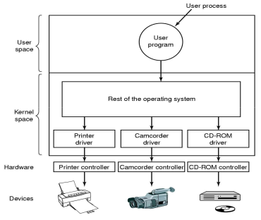
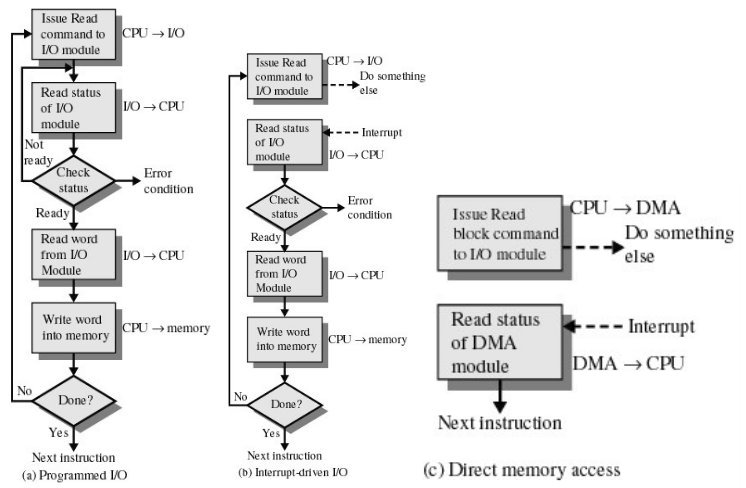
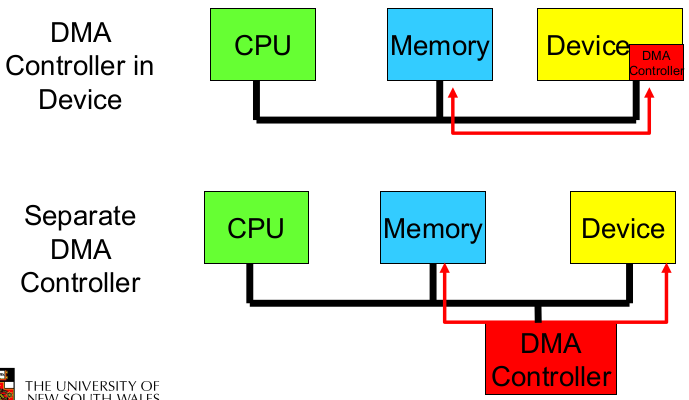
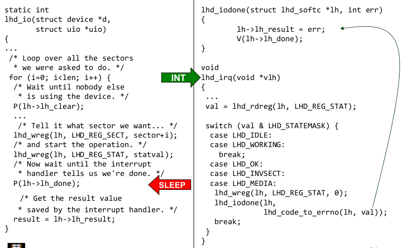
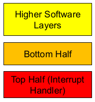
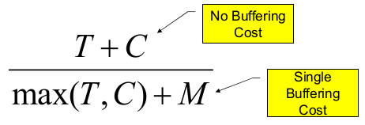
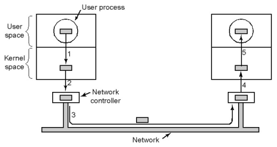
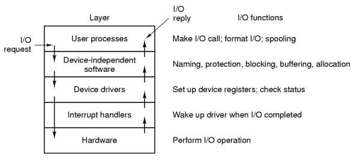

# I/O Management

There exists a large variety of I/O devices.

Many of them have different properties and they seem to require different interfaces to manipulate and mange them. We don't want a new interface for every device, but something uniform and efficient.

## Device Drivers

The logical position of device drivers is shown below.

Originally, **drivers** were compiled into the kernel (e.g. OS/161). Device installers were technicians and the number and types of devices rarely change.

Nowadays, they are **_dynamically_** loaded when needed (e.g. Linux modules). Typical users (device installers) can't build kernels. The number and types of devices vary greatly.

Drivers are classified into similar categories; **block** devices and **character** (stream of data) devices. The OS defines a standard (internal) interface to the different classes of devices; e.g. USB Human Input Device (HID) class specifications - human input devices follow a set of rules making it easier to design a standard interface

Some USB Device Classes:

The data rate may be in differences of several orders of magnitude between the data transfer rates  
Example:. assume 1000 cycles/byte I/O  
A keyboard needs a 10KHz processor to keep up  
A Gigabyte Ethernet needs a 100 GHz processor...

Some sample data rates:

A **device driver's** job is to translate requests through the device-independent standard interface (open, close, read, write) into appropriate sequences of commands (register manipulations) for the particular hardware.  
It initialises the hardware at boot time, and shuts it down cleanly at shutdown

After issuing the command to the device, the device either

* completes immediately and the driver simply returns to the caller or,
* the device must process the request and the driver usually blocks waiting for an I/O complete interrupt

Drivers are **_thread-safe (synchronised)_** as they can be called by another process while a process is already blocked in the driver.

### Device-Independent I/O Software

There is commonality between drivers of similar classes. We divide I/O software into device-dependent and device-independent I/O software.  
Device-independent software include:

* buffer or buffer-cache management
* TCP/IP stack
* managing access to dedicated devices
* error reporting

### Driver ⬄ Kernel Interface

A major issue is uniform interfaces to devices and the kernel

A **uniform device interface for kernel code** allows different devices to be used in the same way. There is no need to re-write the file-system to switch between SCSI, IDE or RAM disk. However, it allows internal changes to device driver to potentially break kernel code

A **uniform kernel interface for device code** allows the kernel to evolve without breaking existing drivers. Drivers use a defined interface to kernel services (e.g. kmalloc, install IRQ handler etc.)

Together both uniform interfaces avoid a lot of programming implementing new interfaces. It retains compatibility as drivers and kernels change over time

## Architectures

Accessing I/O controllers:

**a) separate I/O and memory space** - I/O controller registers appear as I/O ports and are accessed with special I/O instructions  
**b) memory-mapped I/O** - the controller registers appear as memory and we use normal load/store instructions to access them  
**c) hybrid** - x86 has both ports and memory mapped I/O

Bus architectures:

**a)** a single-bus architecture  
**b)** a dual-bus architecture

The Intel IXP420 architecture:

Given devices that connected to an **Interrupt Controller** via lines on an I/O bus (e.g. PCI), the Interrupt Controller signals interrupts to the CPU and is eventually acknowledged. The exact details are architecture specific.

## I/O Interaction

The CPU issues an I/O request to the I/O module.(controller).

**Programmed I/O** is also called **polling** or **busy waiting**.  
In this, the module performs the action, not the processor. It sets the appropriate bits in the I/O status register. During this no interrupts occur and the processor checks the status until the operation is complete  
Since the processor is constantly _polling_ the status, it **wastes CPU cycles**

In **interrupt-driven I/O**, the processor is interrupted when the I/O module (controller) is ready to exchange data. The processor is free to do other work and there is no needless waiting.  
This consumes a lot of processor time because every word read or written passes through the processor.

**Direct Memory Access** transfers data directly between Memory and Device. The CPU is not needed for copying  
It can be in the device itself, or separate from it

A DMA transfers a block of data directly to or from memory. An interrupt is sent when the task is complete. The processor is only involved at the beginning and end of the transfer.

DMA considerations:

* reduces number of interrupts - less (expensive) context switches or kernel entry-exits
* requires contiguous regions (buffers) for copying; some hardware supports "scatter-gather"
* synchronous/asynchronous
* shared bus must be arbitrated (hardware); CPU cache reduces (but does not eliminate) the need for a bus

The process to perform DMA transfer:

## I/O Management Software

### OS Design Issues

* Efficiency
Most I/O devices are slow compared to main memory (and the CPU). Ideally, we would like to do as much computation in parallel with I/O without waiting for it. The use of multiprogramming allows for some processes to be waiting on I/O while another processes executes. Often I/O still cannot keep up with processor speed. Swapping may be used to bring in additional _ready_ processes (how their may result in more I/O operations).
The goal is to optimise I/O efficiency - especially Disk and Network I/O
* The quest for generality/uniformity
Ideally, we handle all I/O devices in the same way (both in the OS and in user applictions).
We want to hide most of the details of device I/O in lower-level routines so that processes and upper levels see devices in general terms such as read, write, open, close. However, there is the problem of:
    * Diversity of I/O devices
    * Different access methods (random access vs stream based) as well as vastly different data rates
    * Generality often compromises efficiency

### I/O Software Layers

Layers of the I/O software system:

### Interrupt Handlers

**Interrupt handlers** can execute at (almost) any time. This raises complex concurrency issues in the kernel and can propagate to the userspace (signals, upcalls), causing similar issues. Interrupt handlers are generally structured so that I/O operations block until interrupts notify them of completion. See `kern/dev/lamebus/lhd.c` in OS/161 source code.

Interrupt handler steps:

1. **save registers** not already saved by hardware interrupt mechanism
2. (optionally) **set up context** for interrupt service procedure
Typically, the handler ruins in the context of the currently running process, so there is no expensive context switch
3. **set up stack** for interrupt service procedures
The handlers usually run on the kernel stack of the current process or "nests" if already in kernel mode by running on the kernel stack
4. **ack/mask interrupt controller**, re-enable other interrupts
This implies potential for interrupt nesting
5. **run interrupt service procedures**
    1. acknowledges interrupt at device level
    2. figures out what caused the interrupt; received a network packet, disk read finished, UART transmit queue empty
    3. if needed, signals blocked device driver
6. in some cases, will have **woken up a higher priority blocked thread**
    1. choose a newly woken thread to schedule next
    2. set up MMU context for process to run next
7. **load new/original process' registers**
8. **re-enable interrupt** and start running new process

An interrupt generally has no **context** (it runs on the current kernel stack). It is unfair to sleep on interrupted processes (because deadlock is possible), but we need a way to get the context for a long running process

For this there is **top and bottom half**. Linux implements something similar with `tasklets` and `workqueues`. Generically, in-kernel thread(s) handle long running kernel operations.

The **top and bottom half** are related to the device driver itself

The **top half** is an interrupt handler that remains short. It simply acknowledges the device and defers the rest of the work to the **_bottom half_** in a queue.  
The **bottom half** is preemptable by the top half (interrupts) and performs the work deferred by the top half (e.g IP stack processing). It is checked prior to every kernel exit. The bottom half can't block, but it does signal blocked processes/threads to continue.  
Together they enable low interrupt latency.

Stack usage:

1. Higher-level software
2. Interrupt processing (interrupts disabled)
3. Deferred processing (interrupt re-enabled)
4. Interrupt while in bottom half

An alternative to the _top and bottom half_  is **deferring work to in-kernel threads**.  
Interrupt handlers defers work onto in-kernel thread. The in-kernel thread handles deferred work (DW). It (the thread) is scheduled normally and can block. It can provide both low interrupt latency and blocking operations. In terms of processing power, it is more costly to defer work to a thread due to context switching.

Linux's `tasklests` resemble the top and bottom half while `workqueues` use threads.

### Buffering

For device-independent software, here are some possible buffering scenarios:

a) unbuffered input  
b) buffering in user space
c) _single buffering_ in the kernel followed by copying to user space
d) _double buffering_ in the kernel

#### No Buffering

With no buffering, a process must read/write a device a byte/word at a time. Each individual system call adds significant overhead. The process must wait until each I/O is completed. Blocking, interrupts and waking adds to overhead. Many short runs of a process is inefficent (poor CPU cache temporal locality)

#### User-Level Buffering

In user-level buffering, the process specifies a memory _buffer_ that incoming data is placed until it fills. Filling can be done by interrupt service routine. There is only a single system call, and block/wakeup per data (for efficiency)

Issues:

* what happens if the buffer is paged out to disk?
    * could lose data while unavailable buffer is paged in
    * could lock buffer in memory (needed for DMA), however many processes doing I/O reduce RAM available for paging. Can cause deadlock as RAM is a limited resource
* consider the write case
when is the buffer available for reuse
    * either the process must block until a potential slow device drains the buffer
    * or deal with a synchronous signals indicating the buffer is drained

#### Single Buffer

The OS assigns a buffer in kernel's memory for an I/O request.

In a stream-oriented scenario, it is used a line at a time. For example, the user input from a terminal is one line at a time with carriage return signalling the end of the line. Output to the terminal is one line at a time

In a block-oriented scenario, input transfers are made to the buffer. The block is copied to the user space when needed and another block is written into the kernel-buffer (to read ahead)

The user  process can process one block of data while the next block is read in. Swapping can occur since input is taking place in system memory, not user memory. The operating system keeps track of assignment of system buffers to user processes.

The speed up time from a single buffer:  
Assume

* T is transfer time for a block from device
* C is computation time to process an incoming block
* M is time to copy the kernel buffer to the user buffer

Computation and transfer can be done in parallel.  
The speed up with buffering is:

We start to lose characters or drop network backs when any of the following occur:

* the kernel buffer is full
* the user buffer is swapped out
* the application is slow to process the previous buffer and more data is received

#### Double Buffer

In this, we use two system buffers instead of one. A process can transfer data to or from one buffer while the operating system empties or fills the other buffer.

The computation and memory copy can be done in parallel with transfer, so the speed up with double buffering is:

Usually M is much less than T giving a favourable result

This may be insufficient for really bursty traffic e.g.

* lots of application writes between long periods of computation
* long periods of application computation while receiving data
* might want to read-ahead more than a single block for disk

#### Circular Buffer

In a **circular buffer**, more than two buffers are used. Each individual buffer is one unit in a circular buffer. It is used then an I/O operations must keep up with the process.

#### Buffering Summary

Notice that buffering, double buffering and circular buffering are **bounded-buffer producer-consumer problems**

Is buffering always good?  
No...when the cost of copying from the buffer to the application (M) starts to approach the cost of either the transfer (T) or compute (C)

Buffering in Fast Networks:

Networking may involve many copies. Copying reduces performance, especially if copying costs are similar to or greater than computation or transfer costs. Super-fast networks put significant effort into achieving zero-copy. Buffering also increases latency.

### I/O Software Summary

The layers of the I/O system and the main functions of each layer

