# Overview

## What is an operating system?

The OS can be seen as an **abstract machine**. It extends the basic hardware with added functionality. The OS provides high level abstractions so that is is more programmer friendly and there is a common core for all applications. It hides the details of hardware and makes application code portable

The OS can also be seen as a **resource manager**. It is responsible for allocating resources to users and processes. It must ensure there is

* no starvation
* progress
* allocation according to some desired policy - e.g. first-come, first-served; fair share; weighted fair share; limits (quotas) etc.
* the system is efficiently used

A structural (implementation) view: the OS **_is_** the software _privileged_ mode


The **OS kernel** (also called **nucleus** and **supervisor**) is a portion of the operating system that is running in _privileged mode_. It usually stays in main memory and contains fundamental functionality; such as whatever is required to implement other services and to provide security. The kernel contains most-frequently used functions.

The OS is privileged. Applications should not be able to interfere or bypass the OS. The OS can enforce the "extended machine" and its resource allocation policies. This prevents applications from interfering with each other.

Delving deeper into the structure of a computer system


It is important to note that:

* the OS can interact with memory, devices, and applications
* the application can only interact with itself and system libraries; the only way it can interact with the OS is via system calls which are performed in system libraries

Some embedded OSs have **no privileged** component. e.g. PalmOS, Mac OS 9, RTEMS. They can implement OS functionality, but cannot enforce it. This means all software runs together, there is no isolation and one fault can potentially bring down the entire system.

**System libraries** are libraries of support functions (procedures, subroutines). Only a subset of library functions are actually system calls. Consider the following functions:

* `strcmp()` and `memcpy()` are **pure library functions**. They manipulate memory within the application, or perform computation
* `open()`, `close()`, `read()`, `write()` are **system calls**. They cross the user-kernel boundary. e.g. to read from a disk device. Their implementation is mainly focused on passing requests to the OS and returning results to the application

System call functions are in the library for convenience. Try `man syscalls` on Linux for a list of system calls.

Fundamentally, OS functions the same way as ordinary computer software. It is machine code that is executed (with the same machine instructions as applications). It has more privileges (i.e. extra instructions and access). The OS relinquishes control of the processor to execute other programs, then it re-establishes control after system calls and interrupts (especially timer interrupts).

## OS Internal Structure

Most operating systems are designed as a **monolithic operating system structure** (also called the "spaghetti nest" approach). Basically everything is tangled up with everything else, however there is some reasonable structure that usually prevails.

Below are the monolithic structures of Linux and Windows


# Processes and Threads

Major requirements of an operating system include:

* interleave the execution of several processes to maximise processor utilisation while providing reasonable response time
* allocate resources to processes
* support interprocess communication and user creation of processes

**Processes**, also called a **task** or **job** are an execution of an individual program. It is the _owner_ of resources allocated to it for program execution. A process encompasses one or more threads.

**Threads** are a unit of execution. They can be traced meaning you can list the sequence of instructions that execute. Threads belong to a process and execute within the process.

## The Process Model

This is the execution snapshot of three **single-threaded** processes (with no virtual memory). The **program counter** stores the address of the instruction that is currently executing. In the case below we are currently running process B.


Here is an example of what the combined trace of processes above would look like:


Note that none of the processes finish execution in a single run. They all run for a brief moment before another process takes its place, however from the processes perspective they are running from start to finish. In this process model, only one program is active at any instant

Process and thread models for Operating Systems


Here are some examples of Operating Systems implementing the above models

* Single process, single thread MS-DOS
* Single process, multiple threads - OS/161 as distributed
* Multiple processes, single thread - Traditional UNIX
* Multiple processes, multiple threads - Modern Unix (Linux, Solaris), Windows

## Processes

### Process Creation

Principle events that cause process creation include:

* system initialisation
    * foreground processes -interactive processes
    * background processes (also called daemon in Unix and service in Windows) - non-interactive processes such as servers (email, web, print)
* execution of a process creation system call by a running process; e.g. a new login shell for an incoming ssh connection
* user request to create a new process
* initiation of a batch job

Note: technically all these cases use the same system mechanism to create new processes

### Process Termination

Processes terminate under the following conditions:

1. normal exit (voluntary)
2. error exit (voluntary)
3. fatal error (involuntary)
4. killed by another process (involuntary)

### Process Implementation

A processes' information is stored in a **process control block (PCB)**. The PCBs form a **process table** which in reality is typically implemented as a dynamic data structure in a modern OS.

Example possible fields in a process table for different types of management


### Process States

Process and threads can have the following states:

1. running
2. blocked
3. ready

The transitions between the states can be seen below:


A state may change from _running  to ready_ when the process or thread voluntarily `yield()` or they reach the end of their time slice  
A state may change from _running to blocked_ when the process or thread is waiting for input (from a file or network), waiting for a timer (alarm or signal) or waiting for a resource to become available.

The **scheduler**, also called the **dispatcher** has to choose a ready process to run. It is inefficient to search through all processes, so there is a queue.


When an _unblocking_ event occurs, we also have a queue so that we don't need to check if they are ready. In fact it is not uncommon to have queues for different types of blocking events.


## The Thread Model

We can have a thread model where each process has a single thread or a model where a single process can have multiple threads.


Here is a list of items we would need to track when separating execution from the environment


Using an analogy to a Hamburger restaurant, we can visually represent the different types of thread models we can have:


| Model                     | Characteristics                                       |
| ---                       | ---                                                   |
| Single-threaded process   | No parallelism, blocking system calls                 |
| Multi-threaded process    | Parallelism, blocking system calls                    |
| Finite-state machines     | Parallelism, non-blocking system calls, interrupts    |

We define

* a event or request to be **blocking** when other actions **cannot** be performed while we wait for the result. This means we always get a result, but we will have to wait for it
* a event or request to be **non-blocking** when other actions **can** be performed while we wait for a result. The request will return immediately without the result but we are able to continue execution of other actions. When the result is ready, the program will be _notified_ and can return to completing actions related to the request originally made

In the thread model, each thread has its own stack.


Local variables are **per thread** and they are allocated on the stack.  
Global variables are **shared between all threads** and are allocated in the data section. Uncoordinated access to global variables can "corrupt" the intended value in the variable resulting in concurrency control issues.  
Dynamically allocated memory can be **global or local** depending on the pointer pointing to the memory; global pointers means the memory is global, local pointers means memory is local

### Multi-thread Model vs. Finite State (Event) Model

Both models allow parallelism. However, in the thread model, the program state is stored implicitly in the stack. All threads execute are aware only of their own state and do not care about what is happing outside of it. In the Event model, the state is explicitly managed by the program, meaning it has some book-keeping on event happening in the program.


Why threads?

We use threads because:

* they are **simpler** to program than a state machine
* **less resources** are associated with them than a complete process; it is cheap to create and destroy and they share resources (especially memory) between each other
* **performance** - threads waiting for I/O can be overlapped with computing threads. Note that if all threads are _compute bound_, then there is no performance improvement (on a uniprocessor)
* take advantage of **parallelism** available on machines with more than one CPU (multiprocessor)

### Thread Usage


Here is a rough outline of code for the multi-threaded web server

``` C
// dispatcher thread
while (TRUE) {
    get_next_request(&buf);
    handoff_work(&buf);
}


// worker thread - can overlap disk I/O with execution of other threads
while (TRUE) {
    wait_for_work(&buf);
    look_for_page_in_cache(&buf, &page);
    if (page_not_in_cache(&page))
        read_page_from_disk(&buf, &page);
    return_page(&page);
}
```

# Concurrency and Synchronisation

Consider the following example:

`count` is a global variable that is shared between two threads implementing the functions below. After `increment()` and `decrement()` complete, what is the  value of `count`?

``` C
void increment() {
    int t;
    t =  count;
    t = t + 1;
    count = t;
}


void decrement() {
    int t;
    t =  count;
    t = t - 1;
    count = t;
}
```

We don't know. We can't make assumptions about the execution of threads relative to each other. Both threads have access to `count` and when it is accessed in an uncoordinated manner, `count` will not store its intended value.

This is known as a **race condition**.

## Where does concurrency occur?

Concurrency can occur in a multiple processes with a single thread or in a single process with multiple threads.


There is in-kernel concurrency even for single threaded processes because there are global variables and resources in the OS that can be manipulated by processes through system calls.


We can control access to shared resources by controlling access to the code that accesses the resources. Uncoordinated entry to the critical region results in a race condition, which in turn leads to incorrect behaviour, deadlock, lost work etc.

**Critical regions** or **critical sections** are regions of code that access a shared resource and their correctness relies on the shared resource not being concurrently modified by another thread/process/entity.


We've highlighted the critical regions in a basic linked list implementation below.


## Critical Regions Solutions

Our conditions required from solutions to the critical region problem:

1. **mutual exclusions** or **lock** - no two processes can simultaneously access the critical region
2. **no assumptions** can be made about speeds or numbers of CPUS
3. **progress** - no process running outside its critical region may block another process
4. **bounded** - no process waits forever to enter its critical region

### Lock ~~Solution~~

A problematic solution would be using a lock variable.  
If `lock == 1`, somebody is in the critical section and we must wait  
If `lock == 0`, nobody is in the critical section and we are free to enter

Looking at the execution sequence on the right-hand side, it is still possible for two threads to enter critical regions as the same time


### Mutual Exclusion Solutions by Taking Turns

Another proposed solution to the critical region problem is _taking turns_, where access is controlled by a `turn` variable.

``` C
// process 0
while (TRUE) {
    while (turn != 0);
    critical_region();
    turn = 1;
    noncritical_region();
}

// process 1
while (TRUE){
    while (turn != 1) {/*loop*/}
    critical_region();
    turn = 0;
    noncritical_region();
}
```

This works due to _strict alternation_ of each process taking turns.  
It does have the following **disadvantages**:

* busy waiting - a process must wait its turn while the other process is doing something else. If there are many processes, all of them must wait their turn. This does not guarantee progress and overall is a **poor solution** when processes require the critical section for differing durations

### Mutual Exclusion Solutions by Disabling Interrupts

The solution goes like this:

* before entering a critical region, we disable interrupts.  
* after leaving the critical region, we enable interrupts.

This is a nice simple solution that works only on uniprocessor machines.  
It has the following **disadvantages**;

* only available in the kernel; it is not safe to allow applications to disable interrupts
* blocks everyone else, even with no contention; the OS will be unresponsive to interrupts from other devices which is unsafe for extended periods of time
* does not work on a multiprocessor; interrupts are per CPU

### Mutual Exclusion Solutions with Test-and-Set

There is hardware support for mutual exclusion. A **test and set** instruction can be used to implement lock variables correctly (i.e. the lock solution we suggested earlier). It works like this:

``` C
if (lock == 0) {
    set lock to 1
    return the result 0 // we acquire the lock
}

if (lock == 1) {
    return 1            // another thread/process has the lock
}
```

Hardware guarantees that the instruction executes **atomically** (i.e. as an indivisible unit).

``` assembly
enter region:
    TSL REGISTER,LOCK   | copy lock to register and set lock to 1
    CMP REGISTER,#0     | was lock zero?
    JNE enter_region    | if it was non-zero, lock was set, so loop
    RET                 | return to caller; critical region entered

leave_region:
    MOVE LOCK,#0        | store a 0 in lock
    RET                 | return to caller
```

This solution is simple (easy to show it's correct) and available at a user-level to any number of processors and to implement any number of lock variables.  
However because it loops to check whether it can access the critical region, it **busy waits** or **spin locks**. This consumes CPU and starvation is possible when a process leaves its critical region and more than one process is waiting.

A possible solution to the busy-wait problem is by sleeping and waking up the thread/process. The idea is that when the process is waiting for an event, it calls sleep on the process to block it instead of busy waiting. When the event happens, the event generator (another process) calls wakeup to unblock the sleeping process/thread. Waking a ready/running process has no effect.

## The Producer-Consumer Problem

In the **producer-consumer problem** or **bounder buffer problem** we have:

* a producer producing data items and storing them in a buffer
* a consumer taking out the items from the buffer and consuming them


**The issue**: we must keep an accurate count of items in the buffer

The producer should:

* sleep when the buffer is full
* wakeup when there is an empty space in the buffer; the consumer can call wakeup when it consumes the first entry of the full buffer

The consumer should:

* sleep when the buffer is empty
* wakeup when there are items available; the producer can call wakeup when it adds the first item to the buffer

Our first proposed solution uses a locking primitive based on a test-and-set to protect the current access.

```C
int count = 0;
#define N 4     // bufsize

prod() {                                con(){
    while (TRUE) {                          while (TRUE) {
        item = produce();                       if (count == 0)
        if (count == N)                             sleep();
            sleep();                            acquire_lock();
        acquire_lock();                         remove_item();
        insert_item();                          count--;
        count++;                                release_lock();
        release_lock();                         if (count == N-1)
        if (count == 1)                             wakeup(prod);
            wakeup(con);                    }
    }                                   }
}
```

However this has a problematic execution sequence, where `con` may detect `count` is 0, but is then interrupted. `prod` executes all of it's steps, increasing `count` to 1, and calling `wakeup`. Since `con` is still awake nothing happens. We then resume `con` which goes to sleep. :(

Our problem here is that the test for some condition and actually going to sleep is not atomic. If we try the following:

``` C
// producer             // consumer
if (count == N)         if (count == 0)
    sleep();                sleep();
release_lock();         release_lock();

// The lock is held while asleep, so the count will never change
```

## Semaphores

Dijkstra (1965) introduced two primitives that are more powerful than a simple sleep and wakeup;

* `P()`, `wait` or `down` to test and decrement
* `V()`, `signal`, `up` to increment

If a resource is not available the corresponding semaphore blocks any process `wait`ing for the resource. Blocked processes are put into a process queue maintained by the semaphore, avoiding busy waits. When a process releases a resource, it `signal`s this by means of the semaphore. Signalling resumes a blocked process if there is any.  
Wait and signal operations **cannot be interrupted**.  
Complex co-ordination can be implemented by multiple semaphores.

Semaphores can be used to solve a variety of concurrency problems, however programming with them can be error-prone. E.g. you must signal for every wait if you want mutex. Too many or too few signals, or signals and waits in the wrong order can have catastrophic results.

### Semaphore Implementation

``` C
// A semaphore is defined as a record:
typdef struct {
    int count;          // #times a thread can call wait before it is blocked
    struct process *L;  // a linked list of processes blocked
                        // and waiitng for this semaphore
} semaphore;

// Semaphore operations:
wait(S) {
    S.count--;
    if (S.count < 0) {
        add process to S.L;
        sleep();
    }
}

signal(S) {
    S.count++;
    if (S.count <= 0) {
        remove process P from S.L;
        wakeup(P);
    }
}
```

Each primitive is atomic because interrupts are disabled for each.

### Semaphore Uses

#### Synchronisation Tool

Semaphores can be used a synchronisation tool.  
Say we have two threads with functions A and B, where we always want be to execute after A. Using a semaphore count intialised to `0`, all we need is this:

``` C
A() {
    ...
    signal(flag);
}

B() {
    ...
    wait(flag);
}
```

When `A` runs first, `signal` is called but does nothing, then `B` runs.  
When `B` runs first, `wait` is called and `B` becomes blocked. Then `A` runs, `signal`s `B` to wake up and run.

#### Implementation of a Mutex

Implement mutual exclusion by initialising the semaphore count to `1`.

``` C
semaphore mutex;
mutex.count = 1     // init mutex

wait(mutex);        // enter critical region

doStuff();

signal(mutex);      // exit critical region
```

Notice how the initial count determines how many waits can progress before blocking and requiring a signal.

#### Solving the Producer-Consumer Problem

To solve the producer-consumer problem we initialise the semaphore count to the size of the buffer.

```C
#define N 4     // bufsize

semaphore mutex = 1;    // lock for critical regions
semaphore empty = N;    // #empty slots
semaphore full = 0;     // #full slots

prod() {                                con(){
    while (TRUE) {                          while (TRUE) {
        item = produce();                       wait(full);
        wait(empty);                            wait(mutex;
        wait(mutex);                            remove_item();
        insert_item();                          signal(mutex);
        signal(mutex);                          signal(empty);
        signal(full);                       }
    }                                   }
}
```

## Monitors

To ease concurrent programming, Hoare (1974) proposed **monitors**. Monitors are a higher level synchronisation primitive and a programming language construct.

The idea is that a set of procedures, variables and data types are grouped in a special kind of module called a **monitor**. These variables and data types are only accessed from within the monitor. Only one process/thread can be in the monitor at any one time.  
Mutual exclusion is implemented by the compiler, which should be less error prone.

When a process/thread calls a monitor procedure, which already has a process/thread inside, it queues and it sleeps until the current process/thread exits the monitor.


Examples of monitors:

``` C
monitor example {
    int count;;
    procedure inc() {
        count++;
    }
    procedure dec() {
        count--;
    }
}
```

### Condition Variables

**Condition variables** are a mechanism to block when waiting for an event in addition to ensuring mutual exclusion. e.g. for the producer-consumer problem when the buffer is empty or full.

To allow a process to wait within the monitor, a **condition variable** must be declared as: `condition x,y;`.  
Condition variables can only be used with the operations `wait` and `signal`.  
`x.wait()` means that the process invoking this operation is suspended until another process invokes. Another thread can enter the monitor while the original is suspended.  
`x.signal()` resumes exactly **one** suspended process. If no process is suspended, then the `signal` operation has no effect.


Solution to producer-consumer problem using monitors and condition variables:

``` C
monitor ProducerConsumer
    condition full, empty;
    integer count;

    procedure insert(item: integer);
    begin
        if count = N then wait(full);       // sleep cause buffer is full
        insert_item(item)
        count := count + 1;
        if count = 1 then signal(empty);    // buffer no longer empty, wake up consumers
    end

    function remove: integer;
    begin
        if count = 0 then wait(empty);      // sleep cause buffer is empty
        remov = remove_item;
        count := count - 1;
        if count = N-1 then signal(full);   // buffer no longer full, wake up producer
    end;
    count := 0;
end monitor;

procedure producer;
begin
    while true do
    begin
        item = produce_item;
        ProducerConsumer.insert(item);
    end;
end;

procedure consumer;
begin
    while true do
    begin
        item = ProducerConsumer.remove();
        consume_item(item);
    end;
end;
```

## OS/161 Provided Synchronisation Primitives

### Lock Functions

``` C
// Functions to create and destroy locks:
// create a lock by giving it a name (for debugging purposes)
struct lock *lock_create(const char *name);
void lock_destroy(struct lock*);

// Functions to acquire and release locks:
void lock_acquire(struct lock *);
void lock_release(struct lock *);
```

Example use of locks:

``` C
int count;
struct lock *count_lock;

int main() {
    count = 0;
    count_lock = lock_create("countlock");
    if (count_lock == NULL)
        panic("I'm dead");
    stuff();
}

procedure inc() {
    lock_acquire(count_lock);
    count = count + 1;
    lock_release(count_lock);
}

procedure dec() {
    lock_acquire(count_lock);
    count = count - 1;
    lock_release(count_lock);
}
```

If OS/161 cannot enter the critical section, it will put the thread to sleep until lock release is called, where it will allow one of the sleeping threads to enter the critical section

### Semaphore Functions

``` C
// create a semaphore by giving it a name and an initial value
struct semaphore *sem_create(const char *name, int initial_count);
void sem_destroy(struct semaphore(struct semaphore *);

void P(struct semaphore *); // wait
void V(struct semaphore *); // signal
```

Example use of semaphores:

``` C
int count;
struct semaphore *count_mutex;

int main() {
    count = 0;
    count_mutex = sem_create("count", 1);
    if (count_mutex == NULL)
        painc("I'm dead");
    stuff();
}

procedure inc() {
    P(count_mutex);
    count = count + 1;
    V(count_mutex);
}

procedure dec() {
    P(count_mutex);
    count = count - 1;
    V(count_mutex);
}
```

### Condition Variable Functions

You can build a monitor-like design construct by using locks and condition variables

``` C
struct cv *cv_create(const char*name);
void cv_destroy(struct cv *);

void cv_wait(struct cv *cv, struct lock *lock);
// Release the lock and blocks (i.e. puts current thread to sleep)
// Upon resumption, it re-acquires the lock.
// Note: we must recheck the condition we slept on

void cv_signal(struct cv *cv, struct lock *lock);
// Wakes one thread, but does not release the lock
void cv_broadcast(struct cv *cv, struct lock *lock);
// Wakes up all threads, but does not release the lock
// The first "waiter" scheduled after signaller releases the lock will acquire the lock

// Notes: all three variants must hold the lock passed in
```

Example of condition variables with bounded buffers:

``` C
// non solution
lock_acquire(c_lock);
if (count == 0)
    sleep();
remove_item();
count--;
lock_release(c_lock);

// solution
lock_acquire(c_lock);
while (count == 0)          // use while in case other threads have woken up
    cv_wait(c_cv, c_lock);  // before you and made the count equal to 0
remove_item();
count--;
lock_release(c_lock);
```

Solving the producer consumer problem using condition variables and locks:

``` C
int count = 0;
#define N 4     // bufsize

prod() {                            con() {
    while (TRUE) {                      while (TRUE) {
        item = produce();                   lock_acquire(1);
        lock_acquire(1);                    while (count == 0)
        while (count == N)                      cv_wait(full, 1);
            cv_wait(full, 1);               item = remove_item();
        insert_item(item);                  count--;
        count++;                            cv_signal(full,1);
        cv_signal(empty,1);                 lock_release(1);
        lock_release(1);                    consume(item);
    }                                   }
}                                   }
```

## More Concurrency and Synchronisation Problems

### Dining Philosophers

Scenario: philosophers eat and think. When they eat they need 2 forks, but they can only pick up one fork at a time. If all philosophers pick up the fork on their right-hand side, they will be caught in a deadlock and starve to death.

How do we prevent the deadlock?

One solution could be to make it so that only one philosopher on the table can be eating at any time, but this is inefficient if there are lots of philosophers.

Another solution is using semaphores:

``` C
#define N           5           // # of philosophers
#define LEFT        (i+N-1)%N   // # of i's left neighbour
#define RIGHT       (i+1)%N     // # of i's right neighbour
#define THINKING    0           // philosopher is thinking
#define HUNGRY      1           // philosopher is hungry
#define EATING      2           // philosopher is eating

typdef int semaphore;           // semaphores are a special kind of int
int state[N];                   // array to keep track of everyone's state
semaphore mutex = 1;            // mutual exclusion for critical regions
semaphore s[N]                  // one semaphore per philosopher


void philosopher(int i) {       // i is the philosopher number from 0 to N-1
    while (TRUE) {              // repeat forever
        think();                // philospher is thinking
        take_forks(i);          // acquire two forks and block
        eat();                  // yum-yum, spaghetti
        put_forks(i);           // put both forks back on the table
    }
}

void take_forks(int i) {        // i is the philosopher number from 0 to N-1
    down(&mutex);               // enter critical region
    state[i] = HUNGRY;          // record fact that philosopher is hungry
    test(i);                    // try to acquire two forks
    up(&mutex);                 // exit critical regioin
    down(&s[i]);                // block if forks not acquired
}

void put_forks(int i) {         // i is the philosopher number from 0 to N-1
    down(&mutex);               // enter critical region
    state[i] = THINKING;        // philosopher has finished eating
    test(LEFT);                 // see if left neighbour can eat now
    test(RIGHT);                // see if right neighbour can eat now
    up(&mutex);                 // exit critical region
}

void test(int i) {              // i is the philosopher number from 0 to N-1
    if (state[i] == HUNGRY && state[LEFT] != EATING && state[RIGHT] != EATING) {
        state[i] = EATING;
        up(&s[i]);
    }
}
```

### The Readers and Writers Problem

This models access to a database such as a airline reservation system. It can have more than one concurrent reader, but writers must have exclusive access.

Solution:

``` C
typedef int semaphore;
semaphore mutex = 1;                // controls access to 'rc'
semaphore db = 1;                   // controls access to the database
int rc = 0;                         // # of processes reading or waiting to

void reader(void){
    while (TRUE) {                  // repeat forever
        down(&mutex);               // get exclusive access to rc
        rc++;                       // one reader more now
        if (rc == 1) down(&db);     // if this is the first reader...
        up(&mutex);                 // release exclusive access to rc
        rc--;                       // one reader fewer now
        if (rc == 0) up(&db);       // if was the last reader
        up(&mutex);                 // release exclusions access to rc
        use_data_read();            // non-critical region
    }
}

void writer(void){
    while (TRUE) {                  // repeat forever
        think_up_data();            // non-critical region
        down(&db);                  // get exclusive access
        write_data_base();          // update the data
        up(&db);                    // release exclusive acces
    }
}
```

# Deadlock

Examples of computer resources include printers, tape drivers and tables in a database. Processes need access to resources in a reasonable order.  
Preemptable resources can be taken away from a process with no ill effects.  
Non-preemptable resources will cause the process to fail if taken away.

Suppose a process holds resource A and requests resource B. At the same time another process holds B and requests A. Both processes are blocked and remain so. This is known as **deadlock**.

**Deadlock** occurs when processes are granted exclusive access to devices, locks, tables etc. We refer to these entities as **resources**.

The sequence of events required to use a resource:

1. request the resource
2. use the resource
3. release the resource

If the request is denied, the process must wait. As a result the requesting process may be blocked or may fail with an error code.

We have two segments of code:

``` C
// segment 1
semaphore res_1, res_2;
void proc_A() {                     void prov_B() {
    down(&res_1);                       down(&res_1);
    down(&res_2);                       down(&res_2);
    use_both_res();                     use_both_res();
    up(&res_2);                         up(&res_2);
    up(&res_1);                         up(&res_1);
}                                   }

// segment 2
semaphore res_1, res_2;
void proc_A() {                     void prov_B() {
    down(&res_1);                       down(&res_2);
    down(&res_2);                       down(&res_1);
    use_both_res();                     use_both_res();
    up(&res_2);                         up(&res_1);
    up(&res_1);                         up(&res_2);
}                                   }
```

Segment 2 is deadlock prone because the resources are accessed in different orders;  
Say `proc_A` gains access to `res_1`, then `proc_B` runs and gains access to `res_2`. When `proc_A` tries to access `res_2` it is blocked. The same applies to `proc_B` for `res_1`. Now we are in deadlock.

Formal definition: A set of processes are **deadlocked** if each process in the set is waiting for an event that only another process in the set can cause.  
Usually the event is the release of a currently held resource. In this state, none of the processes can run, release resource or be awakened.

There are four conditions for deadlock:

1. **Mutual exclusion** condition - each resource is either assigned to 1 process or is available
2. **Hold and wait** condition - processes holding resources can request additional resource
3. **No pre-emption** condition - allocated resources cannot be forcibly taken away
4. **Circular wait** condition - there must be a circular chain of 2 or more processes with each process waiting for resources held by the next member of the chain

## Deadlock Modelling

We can model deadlock using directed graphs:

* circles represent processes
* squares represent resources


## Dealing with Deadlocks

Strategies for dealing with deadlocks:

1. just ignore the problem altogether
2. prevention by negating one of the four necessary conditions
3. detection and recovery
4. dynamic avoidance - careful resource allocation

### Approach 1: The Ostrich Algorithm

Pretend there is no problem. This is reasonable if deadlocks occur very rarely and the cost of prevention is high; e.g. only one process ones at a time. It is a trade-off between **_convenience_** (engineering approach) and **_correctness_** (mathematical approach)

Windows and UNIX use this approach for some of the more complex resource relationships they manage.

### Approach 2: Deadlock Prevention

Resource allocation rules prevent deadlock by preventing one of the four conditions required for deadlock from occurring.

#### Mutual Exclusion Condition

Attacking the mutual exclusion condition is not feasible in general because some devices and resources are intrinsically not shareable.

#### Hold and Wait Condition

Attacking the hold and wait condition requires processes to **_request for all resources needed before starting_** so that a process never has to wait for what it needs. Issues with this are that

* we may not know the required resources at the start of the process
* ties up resources other processes could be using

A variation of this could be having process give up all resources if it would block a holding resource, then request all resources immediately needed. However this is prone to **livelock**

Livelocked processes are not blocked, but they change their state regularly that they **never make progess**. e.g. Two people pass each other in a corridor that they attempt to step out of each other's way in the same direction indefinitely. Both are actively changing state, but they never pass each other.

Example of livelocked processes:

``` C
void proc_A() {                                 void prov_B() {
    lock_acquire(&res_1);                           lock_acquire(&res_2);
    while (try_lock(&res_2) == FAIL) {              while (try_lock(&res_1) == FAIL) {
        lock_release(&res_1);                           lock_release(&res_2);
        wait_fixed_time();                              wait_fixed_time();
        lock_acquire(&res_1);                           lock_acquire(&res_2);
    }                                               }
    use_both_res();                                 use_both_res();
    lock_release(&res_2);                           lock_release(&res_1);
    lock_release(&res_1);                           lock_release(&res_2);
}                                               }
```

#### No Pre-emption Condition

This is not a viable option. If a process was allocated a printer and halfway through the job, we forcibly take away the printer, the resource and job would fail.

#### Circular Wait Condition

In this, we numerically order resources so that they must be accessed in a specific order. If a resource is not available, the process will simply have to wait.


#### Summary

| Condition         | Approach                                  |
| ---               | ---                                       |
| mutual exclusion  | not feasible                              |
| hold and wait     | allocate all resources needed initially   |
| no pre-emption    | take resources away (not viable)          |
| circular wait     | access resources in specific order        |

### Approach 3: Detection and Recovery

For this, we need a method to determine if a system is deadlocked. Assuming the deadlock is detected, we need a method of recovery to restore the progress of the system.

#### Detection

We can detect deadlocks with one resource of each type via our deadlock modelling. A cycle can be found within the graph denoting a deadlock.


For resources with multiple units such as RAM, blocks on a hard disk drive and slots in a buffer, we can use data structures to detect deadlocks.

We keep track of:

* resources in existence in a vector
* resources available in a vector
* resources currently allocated to process in a matrix
* resources being requested by processes in a matrix

We will refer to these vectors/matrices as **_E_**, **_A_**, **_C_**, **_R_**.


The sum of current resources allocated and resources available should equal the amount of resources in existence


The detection algorithm works like this:

1. Look for an unmarked process _Pi_ in **_C_**, for which the _i_-th row of **_R_** is less than or equal to **_A_**
2. If found add the _i_-th row of **_C_** to **_A_**, and mark _Pi_.  
Then go to step 1.
3. If there are no processes found, terminate.  
Any remaining processes are **_deadlocked_**.

Example: the algorithm terminates with no unmarked processes so there is no deadlock


#### Recovery

We can recover from deadlock though:

* **pre-emption** - take a resource from some other process, however this depend on the nature of the resource
* **rollback** - checkpoint process states periodically. When deadlock is detected roll back to a previous state where deadlock has not occurred. There is no guarantee that deadlock won't happen again.  
This is not very practical because the operating system will be kept busy storing states. Instead this is only practical when you have long running processes (e.g. months) and roll back is necessary if data is ever lost
* **killing processes** - a simple but crude way of breaking deadlock by killing one of the process in the deadlock cycle. The other process will get its resource but the killed one will have to run from the beginning.

### Approach 4: Deadlock Avoidance

We can avoid deadlock only if we have enough information in advanced; that is we need to know the max no. of resources required.

Note: deadlock prevention and avoidance are not the same - prevention the attacks conditions of deadlock while avoidance comes up with a way of allocating resources so that deadlock does not occur.

Here we have graph of two process resource trajectories, where

* the x-axis represents the progress of process A
* the y-axis represents the progress of process B


If the dotted line enters where the rectangles overlap, it will be in an **unsafe state**.

A state is **safe** if:

* the system is not deadlocked
* there exists a scheduling order that results in every process running to completion, _even if they all request their maximum resources immediately_


Unsafe states are not necessarily deadlocked; with a lucky sequence, all processes may complete. However, we **cannot guarantee** that they will complete (not deadlock).  
Safe states guarantee we will eventually complete all processes.

#### Banker's Algorithm

A deadlock avoidance algorithm only grants requests that result in safe states. For this we'll use the **Banker's algorithm**.

The banker's algorithm is modelled on a banker with customers.  
The banker has a limited amount of money to loan customers (the limited no. of resources). Each customer can borrow money up to the customer's credit limit (the max. no. of resource required)

The basic idea is that we want to keep the bank in a _safe_ state so all customers are happy even if they all request to borrow up to their credit limit at the same time. Customers wishing to borrow such that the bank would enter an unsafe state must wait until somebody else repays their loan such that the transaction becomes safe.

The Banker's algorithm for a single resource:


In (b) process B requests one more resource. To determine whether we should give it or not we get (c) and see that the state is no longer safe. As a result, process B does not get its requested resource.

The Banker's algorithm for multiple resources is structured similarly to deadlock detection with multiple resources. If there aren't enough resources, the state becomes unsafe.


The Banker's algorithm is not commonly used in practice. It is difficult (sometimes impossible) to know in advance the resources a process will require and the number of processes in a dynamic system.

## Starvation

Starvation is when a process never receives the resource it is waiting for. Despite the resource (repeatedly) becoming free, it is always allocated to another waiting process.

E.g. An algorithm to allocate a resource may be to give the resource to the shortest job first. This works great for multiple short jobs in the system, but may cause a long job to wait indefinitely even though it is not blocked.

A solution to this would be to implement a first-come, first-serve policy.

# Processes and Threads Implementation

## MIPS R3000

MIPS uses a load-and-store architecture. There are no instructions that operate on memory except for load and store ones.

Simple load/stores to/from memory from/to registers:

* store word: `sq r4 (r5)` stores the contents of `r4` in memory using the address contained in register `r5`
* load word: `lw r3 (r7)` loads the contents of memory into `r3` using the address contained in `r7`. There is a delay of one instruction after load before data is available in the destination register. There **must always** be an instruction between a load from memory and the subsequent use of the register.
* other load/store instructions: `lw sw lb sb lh sh`

Arithmetic and logical operations are register-to-register operations. There are no arithmetic operations in memory.

Examples:

``` assembly
add r3, r2, r1  # r3 = r2 + r1

# other instructions
add # add
sub # subtract
and
or
xor
sll # shift left logical
srl # shift right logical
```

All instructions are encoded in 32-bit. Some instructions have _immediate_ operands. Immediate values are constants encoded in the instruction itself and are of 16-bit value.

Examples:

``` assembly
addi r2, r1, 2048   # r2 = r1 +2-48
li   r2, 1234       # r2 = 1234
```

Examples: `a = a + 1` in MIPS

``` assembly
lw  r4, 32(r29)     # r29 = stack pointer, store value of a in r4
li  r5, 1
add r4, r4, r5      # r4 = r4 + 1
sw  r4, 32(r29)     # store result back into a
```

### MIPS Registers

User-mode accessible registers:

* 32 general purpose registers
    * `r0` is hard-wired to `0`
    * `r31` is the **link** register for `jal` instruction, which stores the return address for when a `jal` completes
* `HI`/`LO` - `2 * 32-bits` for multiply and divide
* `PC` - the program counter. It is not directly visible and is modified implicitly by jump and branch instructions

### Branching and Jumping

Branching and jumping have **branch delay slot**. The instruction following a branch or jump is **always executed prior**  to the destination.

``` assembly
    li  r2, 1       # r2 = 1
    sw  r0, (r3)    # r3 = 0
    j   1f          # execute next instruction, then jump to 1:
    li  r2, 2       # r2 = 2
    li  r2, 3       # r2 = 3

1:  sw r2, (r3)     # store value of r2 into memory address at r3, which is 2
```

This is because MIPS uses RISC architecture; a 5 stage pipeline, where instructions are partially through a pipeline prior to `jump` having an effect


The `jal` (jump and link) instruction is used to implement function calls. When this happens `r23 = PC +8`. This is where the return address is stored when we return from the function call.


### Compiler Register Conventions

There are 32 registers in MIPS and they all have some associations:

| Reg#      | Name      | Used for                                                  |
| ---       | ---       | ---                                                       |
| `0`       | `zero`    | Always returns 0. It's value is unchangeable              |
| `1`       | `at`      | **assembly-temporary** Reserved for use by the assembler  |
| `2-3`     | `v0-v1`   | Value (except `FP`) returned by subroutine                |
| `4-7`     | `a0-a3`   | (**arguments**) First four parameters for a subroutine    |
| `8-15`    | `t0-t7`   | (**temporaries**) subroutines may use without saving      |
| `16-23`   | `s0-s7`   | Subroutine **register variables**: a subroutine which will write in one of these must save the old value and restore it before it exits, so the _calling_ routine sees their value preserved |
| `24-25`   | `t8-t9`   | (**temporaries**) subroutines may use without saving      |
| `26-27`   | `k0-k1`   | Reserved for use by interrupt/trap handler - may change under your feet |
| `28`      | `gp`      | **global pointer** - some runtime systems maintain this to give easy access to some `static` or `extern` variables |
| `29`      | `sp`      | **stack pointer**                                         |
| `30`      | `s8/fp`   | 9th **register variable**. Subroutines which need one can use this pointer as a **frame pointer** |
| `31`      | `ra`      | Return address for subroutine                             |

Example of a factorial function in MIPS


### Function Stack Frames

Each function call allocated a new stack frame for local variables, the return address, previous frame pointer etc.  
The frame pointer points to the **start** of the current stack frame  
The stack pointer points to the **end** of the current stack frame

Example: assume `f1()` calls `f2()` which calls `f3()`


MIPS' calling convention for `gcc` has space reserved for arguments 1 to 4


Example:


## The Process Model

Processes minimally consist of three segments

* **text** containing the code (instructions)
* **data** for global variables
* **stack** for activation records of procedures/functions/methods and for local variables

Note: data can be dynamically grow up (via `malloc()`) and the stack can dynamically grow down (e.g. by increasing function call depth or recursion).

Below shows a processes stack and execution state at user and kernel levels


In user mode, processes (programs) are scheduled by the kernel and are isolated from each other. System calls transition into and return from the kernel  
In kernel mode, nearly all activities are still associated with a process. The kernel memory is shared between all processes and concurrency issues exist between processes concurrently executing in a system call.

## The Thread Model

)

In the thread model, we have items shared by all threads in a process and items that exist per thread.


Each thread has its own stack


Here is a subset of POSIX threads API

``` C
int     pthread_create(pthread_t *, const pthread_attr_t *, void *(*)(void *), void *);
void    pthread_exit(void *);

int     pthread_mutex_init(pthread_mutex_t *, const pthread_mutexattr_t *);
int     pthread_mutex_destroy(pthread_mutex_t *);
int     pthread_mutex_lock(pthread_mutex_t *);
int     pthread_mutex_unlock(pthread_mutex_t *);

int     pthread_rwlock_init(pthread_rwlock_t *, const pthread_rwlockattr_t *);
int     pthread_rwlock_destory(pthread_rwlock_t *);
int     pthread_rwlock_rdlock(pthread_rwlock_t *);
int     pthread_rwlock_wrlock(pthread_rwlock_t *);
int     pthread_rwlock_unlock(pthread_rwlock_t *);
```

Independent of where we implement the threads, the application will call the library of POSIX threads

If the application calls the library to create the threads, we can implement this functionality at a user-level or kernel-level. We could create a library in the system libraries (independent of the operating system); known as **user-level threads**. The library that provides the threads doesn't make any system calls, or cross into the operating system; the operating system will not be aware of these threads. Alternatively we could call into the library and it would call thread create in the operating system. The operating system will provide the implementation

### Implementing Threads in the User Space

A view of user-level threads:


Implementation at user level means

* there is a User-Level Thread Control (TCB), ready queue, blocked queue, and dispatcher.
* the kernel has no knowledge of the threads and it only sees a single process
* if a thread blocks waiting for a **_resource held by another thread inside the same process_** (i.e. not a OS-based resource), its state is saved and the dispatcher switches to another ready thread
* thread management (create, exit, yield, wait) are implemented in a runtime support library

**Advantages**:

* thread management and switching at user-level is much **faster** than doing it in kernel level. There is no need to trap (take syscall exceptions) into the kernel and switch back
* the dispatcher algorithm can be tuned to the application. e.g. use priorities
* can be **implemented on any OS** (thread or non-thread aware)
* can easily **support massive numbers of threads** on a per-application basis.  
Uses normal application memory. Kernel memory is more constrained and it difficult to efficiently support differing numbers of threads for different applications

**Disadvantages**:

* threads have to `yield` manually since there is no timer interrupt delivery to the user-level. This is known as **co-operative multithreading**. A single poorly designed/implemented thread can monopolise the available CPU time.  
There are workarounds (e.g. a time signal per second to enable pre-emptive multi-threading)
* does not take advantage of multiple CPUs (in reality we still have a single threaded process as far as the kernel is concerned)
* if a thread makes a blocking system call (or takes a page fault), the process (and all the internal threads) block

### Implementing Threads in the Kernel Space

A view of kernel-level (or kernel-provided) threads:


Threads are implemented by the kernel so

* TCBs are stored in the kernel. A subset of information (related to execution context) is in a traditional PCB. The TCBs have PCBs associated with them; resources are associated with the group of threads (the process)
* thread management calls are implemented as system calls; e.g. create, wait, exit

**Advantages**:

* **pre-emptive multi-threading**
* **parallelism** - we can overlap blocking I/O with computation and take advantage of a multiprocessor

**Disadvantages**:

* thread creation and destruction, blocking and unblocking threads requires kernel entry and exit, which is more expensive than the user-level equivalent

## Multi-programming Implementation/Context Switching

A skeleton of what the lowest level of an operating system does when an interrupt occurs; i.e a **context switch**

1. Hardware stacks program counter onto the kernel stack
2. Hardware loads new program counter from interrupt vector of where we will transition to
3. Assembly language procedure saves registers
4. Assembly language procedure sets up new stack
5. C interrupt service runs (typically read and buffers input)
6. Scheduler decides which process is to run next
7. C procedure returns to the assembly code
8. Assembly language procedure starts up new current process

A **context switch** can refer to:

* a switch between threads involving saving and restoring a state associated with a thread
* a switch between processes involving the above plus extra states associated with a process (e.g. memory maps)

A switch between process/threads can happen any time an OS is invoked on:

* a system call - mandatory if the system call blocks or on `exit()`
* a exception - mandatory if the offender is killed
* an interrupt - triggering a dispatch is the main purpose of the _timer_ interrupt

**A thread switch can happen between any two instructions**

Note: instructions do not equal program statements; a program statement can be made of multiple instructions

Context switch must be **transparent** for processes/threads. When dispatched again, a process/thread should not notice that something else was running in the meantime (except for elapsed time); so the OS must save **all** state that affects the thread.

The state is called the **process/thread context**.  
Switching between process/threads results in a **context switch**

A diagram of a simplified explicit thread switch:


Assuming we have kernel-level threads, we will go through an example of a context switch


### Thread Switching in OS/161

The **very basic** idea behind the thread switch

``` C
// file: switchframe.c
// Note: lots of code removed - only basics
// of picking the next thread and running it reamin

static
void
thread_switch(threadstate_t newstate, struct wchan *wc, struct spinlock *lk)
{
    struct thread *cur, *next;

    cur = curthread;
    do {
        next = threadlist_remhead(&curcpu->c_runqueue);
        if (next == NULL) {
            cpu_idel();
        }
    } while (next == NULL);

    /* do the switch (in assembler switch.S) */
    switchframe_switch(&cur->t_context, &next->t_context);
}
```

``` assembly
# file: switch.S

switchframe_switch:
   /*
    * a0 contains the address of the switchframe pointer in the old thread.
    * a1 contains the address of the switchframe pointer in the new thread.
    *
    * The switchframe pointer is really the stack pointer. The other
    * registers get saved on the stack, namely:
    *
    *      s0-s6, s8
    *      gp, ra
    *
    * The order must match <mips/switchframe.h>.
    *
    * Note that while we'd ordinarily need to save s7 too, because we
    * use it to hold curthread saving it would interfere with the way
    * curthread is managed by thread.c. So we'll just let thread.c
    * manage it.
    */

   /* Allocate stack space for saving 10 registers. 10*4 = 40 */
   addi sp, sp, -40

   /* Save the registers */
   sw   ra, 36(sp)
   sw   gp, 32(sp)
   sw   s8, 28(sp)
   sw   s6, 24(sp)
   sw   s5, 20(sp)
   sw   s4, 16(sp)
   sw   s3, 12(sp)
   sw   s2, 8(sp)
   sw   s1, 4(sp)
   sw   s0, 0(sp)

   /* Store the old stack pointer in the old thread */
   sw   sp, 0(a0)

   /* Get the new stack pointer from the new thread */
   lw   sp, 0(a1)
   nop           /* delay slot for load */

   /* Now, restore the registers */
   lw   s0, 0(sp)
   lw   s1, 4(sp)
   lw   s2, 8(sp)
   lw   s3, 12(sp)
   lw   s4, 16(sp)
   lw   s5, 20(sp)
   lw   s6, 24(sp)
   lw   s8, 28(sp)
   lw   gp, 32(sp)
   lw   ra, 36(sp)
   nop                  /* delay slot for load */

   /* and return. */
   j ra
   addi sp, sp, 40      /* in delay slot */
   .end switchframe_switch
```

# System Calls


**System calls** can be viewed as special function calls that provide a controlled entry into the kernel. While in the kernel, they perform a privileged operations and return to the original caller with the result.  
The system call interface represents the abstract machine provided by the operating system.

A brief overview of the system call interface from the user's perspective:

* process management
* file I/O
* directories management
* some other selected calls
* many more; see `man syscalls` for a list

Some system calls for process management

| Call                                      | Description                                       |
| ---                                       | ---                                               |
| `pid = fork()`                            | create a child process identical to the parent    |
| `pid = waitpid(pid, &statloc, options)`   | wait for a child process to terminate             |
| `s = execve(name, argv, environp)`        | replace a process' core image                     |
| `exit(status)`                            | terminate process execution and return status     |

Some system calls for file management

| Call                                      | Description                              |
| ---                                       | ---                                      |
| `fd = open(file, how, ...)`               | open a file for reading, writing or both |
| `s = close(fd)`                           | close an open file                       |
| `n = read(fd, buffer, nbytes)`            | read data from a file into a buffer      |
| `n = write(fd, buffer, nbytes)`           | write data from a buffer into a file     |
| `position = lseek(fd, offset, whence)`    | move the file pointer                    |
| `s = stat(name, &buf)`                    | get a file's status information          |

A stripped down shell is essentially:

``` C
while (TRUE) {                              // repeat forever
    type_prompt();                          // display prompt
    read_command(command, parameters)       // input from terminal

    if (fork() != 0) {                      // fork off child process
        /* Parent code */
        wait(-1, &status, 0);               // wait for child to exit
    } else {
        /* Child code */
        execve(command, parameters, 0);     // execute command
    }
}
```

Some Win32 API calls and their equivalent UNIX syscalls:


## System Call Implementation

A simple model of CPU computation uses the **fetch-execute cycle**.

1. load memory contents from address in program counter (PC)
2. execute instruction
3. increment PC
4. repeat


There is/are also

* stack pointer (SP)
* status register for condition codes
    * positive result
    * zero result
    * negative result
* general purpose registers, which hold operands of most instructions and enables programmers (compilers) to minimise memory references

In privileged-mode operation, to protect the operating system execution, two or more CPU modes of operation exist;  
**Privileged mode** (or **system/kernel-mode**), where all instructions and registers are available  
**User-mode**, which uses and can only access 'safe' subset of the instruction set. It only affects the state of the application itself and cannot be used to uncontrollably interfere with the OS


An example of an _unsafe_ instruction would be the `cli` instruction on the x86 architecture, which disables interrupts. An example exploit:

``` assembly
cli /* disable interupts */
while (true)
    /* loop forever */
```

The accessibility of addresses within an address space changes depending on the operating mode (to protect kernel code and data). Note that the exact memory ranges are usually configurable and vary between CPU architectures and/or operating systems


### System Call Mechanism Overview

When a system call is made the syscall mechanism securely transfers from user execution to kernel execution and back.


System call transitions are triggered by special processor instructions.  
From user to kernel via a system call instruction  
From kernel to user via a return from a privileged mode instruction

During a system call:

* the processor mode
    * is switched from user-mode to kernel-mode
    * is switched back when returning to user-mode
* the stack pointer (SP)
    * user-level SP is saved and kernel SP is initialised
    * user-level SP is restored when returning to user-mode
* the program counter (PC)
    * user-level PC is saved and PC is set to kernel entry point
    * user-level PC is restored when returning to user-level
    * kernel entry via designated entry point must be strictly **enforced**
* registers
    * set at user-level to indicate the system call type and its arguments; this is a convention between applications and the kernel
    * some registers are preserved at user-level or kernel level in order to restart user-level execution; this depends on the language calling convention etc.
    * result of the system call is placed in registers when returning to user-level; another convention

Steps in making a system call:


### MIPS R2000/R3000

Before we look at system call mechanisms in detail, we'll need a basic understanding of MIPS R3000

The processor control registers are located in CP0. It contains exception/interrupt management registers, translation management registers etc. CP0 is manipulated using `mtc0` (move to and `mfc0` (move from) instructions; these instructions are only accessible in kernel mode

CP0 Registers:

* Exception Management
    * `c0_cause` **stores the cause of the recent exception**
    * `c0_status` **stores the current status of the CPU**
    * `c0_epc` **stores the address of the instruction that caused the exception**
    * `c0_baddvaddr` stores the address accessed that caused the exception
* Miscellaneous
    * `c0_prid` stores the process identifier
* Memory Management
    * `c0_index`
    * `c0_random`
    * `c0_entryhi`
    * `c0_entrylo`
    * `c0_context`

For now we will only focus on the registers in **bold**. We will look at the other ones later


### Hardware Exception Handling


For now we will ignore how the exception is actually handled and how user-level registers are preserved. We will simply look at how we return from the exception.


## MIPS System Calls

In MIPS, system calls are invoked via a `syscall` instruction. The instruction causes an exception and transfers control to the general exception handler. A convention (an agreement between the kernel and application) is required as to how user-level software indicated:

* which system call is required
* where its arguments are
* where the results should go

## OS/161 System Calls

OS/161 uses the following conventions:

* arguments are passed and returned via the normal C function calling convention
* register `v0` contains the system call number;
if successful, register `a3` contains `0` on return
if unsuccessful, `v0` has the error number, which is stored in `errno` and `-1` is returned in `v0`


Here is a walk through of a user-level system call, calling `read()`


From the caller's perspective, the `read()` system call behaves like a normal function. It preserves the calling convention of the language. However the actual function implements its own convention by agreement with the kernel. Our OS/161 example assumes the kernel preserves appropriate registers (`s0-s8`, `sp`, `gp` `ra`). Most languages has similar _libraries_ that interface with the operating system.

On the kernel side of the system call:

* we change to the kernel stack
* preserve registers by saving them into memory (on the kernel stack)
* leave saved registers somewhere accessible to read arguments and store return values
* do the `read()`
* restore registers
* switch back to the user stack
* return to the operation

## OS/161 Exception Handling

Note: the following code is from the uniprocessor variant of 0S/161 (v1.x). It is simpler but broadly similar to the current version


After this, the kernel deals with whatever causes the exception; a syscall, interrupt, page fault etc. and potentially modifies the _trapframe_. `mips_trap` eventually returns


# Computer Hardware Review (Memory Hierarchy)

Operating systems exploit the hardware available and provide a set of high-level services that represent or are implemented by hardware. It manages the hardware reliably and efficiently. Understanding operating systems requires a basic understanding of the underlying hardware.

There is a memory hierarchy where going down the hierarchy, there is

* decreasing cost per bit
* increasing capacity
* increasing access time
* (hopefully) decreasing frequency of access to the memory by the processor (based on the principle of locality)


## Caching

Given two levels of data storage: small and fast vs. large and slow, we can speed access to slower storage by using an intermediate-speed storage as a **cache**

A hardware approach to improving system performance is by using cache memory (SRAM)


CPU cache is fast memory placed between the CPU and main memory with 1 to a few cycles access time compared to RAM access time of tens to hundreds of cycles. It holds recently used data or instructions to save memory accesses. The CPU cache matches slow RAM access time to CPU speed if it has a high hit rate. It is hardware maintained and (mostly) transparent to software. The size of the cache ranges from a few kB to tens of MB. There is usually a hierarchy of caches (2-5 levels), on- and off-chip.

The effective access time of memory subsystem depends on the hit rate in the first level.


Example:  
cache memory access time is 1ns  
main memory access time is 10ns  
hit rate is 95%


### Moving Disk Head Mechanism


Disk can read/write data relatively fast; 15,000rpm drive - 80MB/sec; 1KB block is read in12 microseconds.  
Access time is dominated by the time to late the head over data:

* rotational latency - half one rotation is 2 milliseconds
* seek time -full inside to outside is 8 milliseconds; track to track .5 milliseconds

2 milliseconds is 164KB in "lost bandwidth"

An OS approach to improving system performance is by using main memoy (DRAM)


The strategy is to avoid waiting for disk access by keeping a subset of the disk's data in main memory. The OS uses main memory as a **cache** of disk contents.

An application approach to improving system performance is to store data retrieved from the Internet on your local hard disk:


The strategy is to avoid waiting for Internet access by keeping a subset  of the Internet's data on disk so that the application uses the disk as a cache of the Internet

# File Management

## History

A brief history of file systems:

Early batch processing systems had no OS, I/O from/to punch cards, tapes and drums for external storage, but not file system. There was rudimentary library support for reading/writing tapes and drums.


The first file systems were single-level (everything in one directory). Files were stored in contiguous chunks, where the maximal file size must be known in advance. Now you can edit a program and save it in a named file on the tape.


Time-sharing operating systems required full-fledged file systems. MULTICS used a multi-level directory structure, keeping file that belong to different users separately. It had access control lists and symbolic links.


UNIX was based on ideas from MULTICS with a simple access control model; everything is a file.


## Overview of File System Abstraction


### Files

File systems must provide a convenient naming scheme:

* textual names
* may have restrictions; can only have certain characters e.g. no `/` characters; limited length; only certain format e.g. DOS, 8+2
* case (in)sensitive
* names may obey conventions (`.c` for C files); interpreted by tools (e.g. UNIX); interpreted by operating system (e.g. Windows "con:")

Files are structured as a sequence of bytes. The OS considers a file to be unstructured. Applications can impose their own structure, however a sequence of bytes is used by UNIX, Windows and most modern OSs.

A list of some file types:

* regular files
* directories
* device files; may be divided into character devices (stream of bytes) or block devices

Some systems distinguish between regular file types; ASCII text files, binary files

Files can have **sequential acces** where we can read all bytes/records from the beginning but cannot jump around, but can rewind or back up. This is convenient when the medium is magnetic tape.

There is also **random access** where bytes/records can be read in any order. This is essential for database systems. We can read the file by moving a file pointer then calling read (`lseek(location,...); read();`) or specifying where to read (`read(location,...)`

File attributes:


Typical file operations include:

* create
* delete
* open
* close
* read
* write
* append
* seek
* get attributes
* set attributes
* rename

Example: a program using file system calls:

``` C
/* File copy program. Error checking and reporting is minimal */

#include <sys/types.h>
#include <fcntl.h>
#include <stdlib.h>
#include <unistd.h>

int main(int argc, char *argv[]);

#define BUF_SIZE 4096
#define OUTPUT_MODE 0700

int main(int argc, char *argv[])
{
    int in_fd,, out_fd, rd_count, wt_count;
    char buffer[BUF_SIZE];

    if (argc != 3) exit(1);

    /* Open the input file and create the output file */
    in_fd = open(argv[1], O_RDONLY);
    if (in_fd < 0) exit(2);
    out_fd = open(argv[2], OUTPUT_MODE);
    if (out_fd < 0) exit(3);

    /* Copy loop */
    while (TRUE) {
        rd_count = read(in_fd, buffer, BUF_SIZE);
        if (rd_count <= 0) break;
        wt_count = write(out_fd, buffer, BUF_SIZE);
        it (wt_count <= 0) exit(4);
    }

    /* Close the files */
    close(in_fd);
    close(out_fd);
    if (rd_count == 0)
        exit(0);            /* no error on last read */
    else
        exit(5);            /* error on last read */
}
```

### File Organisation/Layout

Given an operating system supporting unstructured files that are a stream of bytes, how can we organise the contents of the file?  
One such format is the Executable Linkable Format (ELF)


Some possible access patterns:

* read the whole file
* read individual records from the file, where a record is a sequence of bytes containing the record
* read records preceding or following the current one
* retrieve a set of records
* write a whole file sequentially
* insert/delete/update records in a file

Programmers are free to structure the file to suit the application

Things to consider when designing a file layout:

* rapid access; this is needed when accessing a single record, but not needed for batch mode
* ease of update; a file on a CD-ROM will not be updated, so this is not a concern
* economy of storage; should be minimum redundancy in data; redundancy can be used to speed access such as an index

### File Directories

File directories provide a mapping between file names and the files themselves. They contain information about file attributes, location, ownership etc. The directory itself is a file owned by the operating system.


Files can be located by following a path from the root, or master directory down various branches. This is the **absolute pathname** for a file. There can be several files with the same file name as long as they have unique path names.

Always specifying the absolute pathname for a file can be tedious, so we have a **current working directory**; the directory you are currently in. File can then be referenced relative to the working directory.

An **absolute pathname** is a path specified from the root of the file system to the file.  
A **relative pathname** is a path specified from the current working directory  
E.g given `cwd=/home/kevine`, the following files are all the same`../..etc/passwd`, `/etc/passwd`, `../kevine/../.././etc/passwd`

Note: `.` and `..` refer to the current and parent directory respectively

Typical directory operations include:

* create
* delete
* opendir
* closedir
* readdir
* rename
* link
* unlink

### Naming Conventions

Some nice properties of UNIX naming is that it:

* has a simple, regular format - names referring to different servers, objects etc. have the same syntax. Regular tools can be used where specialised tools would be otherwise needed
* is location dependent - objects can be distributed or migrated, and continue with the same names.

An example of a bad naming convention is `UCBVAX::SYS$DISK:[ROB.BIN]CAT_V.EXE;13` from Rob Pike and Peter Weinberger, "The Hideous Name", Bell Labs TR

### File Sharing

In a multi-user system, we want to allow files to be shared among users. The results in two issues:

* access rights
* management of simultaneous access

Common access rights:

* none -the user may not know of the existence of the file and are not allowed to read the directory that includes the file
* knowledge - the user can only determine the file exists and who its owner is
* execution - the user can load and execute the program but cannot copy it
* reading - the user can read the file for any purpose including copying and execution
* appending - the user can add data to the file but cannot modify or delete any of the file's contents
* updating - the user can modify, delete, and add to the file's data. This includes creating the file, rewriting it, and removing all or part of the data
* changing protection - the user can change access rights granted to other users
* deletion - the user can delete the file

For simultaneous access, most operating systems provide mechanisms for users to manage concurrent access to files; e.g. `flock()`, `lockf()` and other system calls. Note that these to not directly prevent access from any users, only from users using the same mechanisms.  
Typically the user may lock the entire file when it is to be updates and they may lock individual records during the update.

Mutual exclusion and deadlock are also issues for shared access.

# File System Internals

UNIX storage stack:


Some popular file systems:


Why are there so many?

* Different physical nature of storage devices
    * Ext3 is optimised for magnetic disks
    * JFFS2 is optimised for flash memory devices
    * ISO9660 is optimised for CD-ROM
* Different storage capacities
    * FAT16 does not support drives >2GB
    * FAT32 becomes inefficient on drives >32GB
    * ZFS, Btrfs is designed to scale to multi-TB disk arrays
* Different CPU and memory requirements
    * FAT16 is not suitable for modern PCs but is a good fit for many embedded devices
* Proprietary standards
    * NTFS may be a nice file system, but its specification is closed

## File Systems for Magnetic Disks

We will focus on file systems for magnetic disks and will make the following assumptions:

* seek time is ~15ms in the worst case
* rotational delay is 8ms in the worst case for a 7200rpm drive

For comparison, disk-to-buffer transfer speed of a modern drive is ~10s per 4K block.  
We can see that mechanical delays introduce significant delays relative to the actual cost of reading a block off a disk. In order to improve this we want to keep blocks that are likely to be accessed together close to each other.

### Implementing a file system

The file system must map symbolic file names into a collection of block addresses. It must keep track of

* which blocks belong to which file
* in which order the blocks form the file
* which blocks are free for allocation

Given a logical region of a file, the file system must track the corresponding block(s) on disk. This is stored in the file system metadata.


### File Allocation Methods

A file is divided into "blocks" - the unit of transfer to storage. Given the logical blocks of a file, we need a way to decide how and where to put the blocks on a disk.


### External and Internal Fragmentation

**External fragmentation** is the space wasted **external** to the allocated memory regions. Memory space exists to satisfy a request, but it is unusable as it is not contiguous.

**Internal fragmentation** is the space wasted **internal** to the allocated memory regions. Allocated memory may be slightly larger than requested memory; this size difference is wasted memory internal to the partition.

### Contiguous Allocation

In **contiguous allocation**, a file occupies a contiguous series of blocks on the disk.  

Advantages:

* easy bookkeeping (need to keep track of the starting block and length of the file)
* increases performance for sequential operations

Disadvantages:

* need the maximum file size for the file at the time of creation
* as many files are deleted, free space becomes divided into many small chunks (external fragmentation)

Examples: ISO 9660 (CD-ROM FS)


### Dynamic Allocation Strategies

In **dynamic allocation** strategies, disk space is allocated in portions as needed. The allocation occurs in **fixed-sized** blocks.

Advantages:

* no external fragmentation
* does not require pre-allocating disk space

Disadvantages:

* partially filled blocks (internal fragmentation)
* file blocks are scattered across the disk
* complex metadata management (maintain the collection of blocks for each file)


#### Linked List Allocation

In a **linked list** allocation, each block contains a pointer to the next block in the chain. Free blocks are also linked in the chain.


Advantages:

* only single metadata entry per file
* best for sequential files

Disadvantages:

* poor for random access
* blocks end up scattered across the disk due to free list eventually being randomised

#### File Allocation Table (FAT)

The **File Allocation Table (FAT)** method keeps a map of the **_entire_** file system in a separate table. A table entry contains the number (location) of the next block of the file much like a linked list. The last block in the file and empty blocks are marked using reserved values.

The table is stored on the disk and is replicated in memory. This allows random access to be fast (following the in-memory disk)


Disadvantages:

* requires a lot of memory for large disks  
`200GB = 200*10^6 * 1K blocks = 200*10^6 FAT entries = 800MB`, which is large back when we didn't have lot of memory
* free block lookup is slow as it searches for a free entry in the table

Example of file allocation table disk layout:


Note that there are two copies of FAT in case one of them every fails.

### Inode-based File System Structure

The idea behind an **inode-based** file system structure is to have a separate table (index-node or i-node or inode) for each file. We only keep the table for open files in memory, allowing fast random access. It is the most popular file system structure today.


Inodes occupy one or several disk areas. In the example below, a portion of the hard disk is reserved for storing inodes.


Inodes  are allocated dynamically, hence free-space management is required for inodes.  
We use fix-sized inodes to simplify dynamic allocation. The inode contains entries for file attributes, references to blocks of where file blocks are located and reserve the last inode entry for a pointer (a block number) to an extension inode. The extension inode will contain block numbers for higher offsets of the file

A diagram of inode entries:


Free space management can be approached two ways:

**Approach 1:** free block list  
We maintain a list of all unallocated/free blocks. Background jobs can re-order the list for better contiguity.  
We store in inode entries other free blocks with the last entry pointing to the next block containing a list of free blocks. This does not reduce the overall disk capacity. Only one block of pointers needs to be kept in main memory (that is the head of the list).

When we need to use free blocks, we go through entries of free blocks in the head of the free block list. When we reach the final entry, the head of the list becomes the next block containing a free block entries and we can use the current block as a free block.


**Approach 2:** free space bitmaps  
We have a bit vector which uses individual bits to flag free and used blocks  
This will reduce the usable disk capacity  
A 16GB disk with 512 byte blocks will have a 4MB table.  
This may be too large to hold in main memory and becomes expensive to search (although optimisations are possible; e.g. a two level table)  
Concentrating (de)allocation in a portion of the bitmap has the desirable effect of concentrating access. It also becomes simple to find contiguous free space.

### Implementing directories

Directories are stored like normal files expect the operating system does not let you access it directly. Directory entries are contained inside data blocks.

The file system assigns special meaning to the content of these files;

* a directory file is a list of directory entries
* a directory entry contains file name, attributes and the file inode number. This maps a human-oriented file-name to a system oriented name

#### Directory Entries

Directory entries can be fixed-sized or variable-sized.

**Fixed-sized** directory entries are either too small (e.g; DOS has an 8 character name and 3 character suffix) or waste too much space (e.g. 255 characters per file name).  
**Variable-sized** directory entries are dynamically allocated within the directory and can cause external fragmentation when these entries are freed. We can reduce external fragmentation by loading entries into RAM and then loading it back.

#### Searching Directory Listings

We can located files in a directory by using:

* a linear scan - implementing a directory cache in software can speed this up
* hash lookups
* B-tree (containing 100s of 1000s of entries)

#### Storing File Attributes


(a) disk addresses and attributes in a directory entry (e.g. FAT)  
(b) directory in which each entry just refers to an inode (e.g. UNIX)

## Trade-off in File System Blocks

File systems deal with 2 types of blocks; disk blocks or sectors (usually 512 bytes). File systems can have blocks the size of `512 * 2^N` where we would like `N` to be optimal.

Larger blocks require less file system metadata, while smaller blocks waste less disk space (less internal fragmentation).  
Sequential access is easier for larger block sizes as fewer I/O operations are required.  
For random access, the larger the block size, the more unrelated data we get loaded. Spatial locality of access is what improves the situation.

Choosing an appropriate block size is a compromise.

# File Management ctd.

Older systems only had a single file system. They had file system specific open, close, read, write and other calls. However modern systems need to support many file system types; e.g. ISO9660 (CDROM), MSDOS (floppy disk), ext2fs, tmpfs.

To support multiple file systems, we could change the file system code to understand different file system types. However this is prone to code bloat, complexity and in general being a non-solution.  
Instead we can provide a framework that separates file system independent and file system dependent code. This allows different file systems to be 'plugged in'. This is basically a **virtual file system**


## Virtual File System (VFS)

A **virtual file system (VFS)** provides a single system call interface for many file systems (e.g. UFS, Ext2, XFS, DOS, ISO9660, etc) and transparent handling of network file systems.  
It also provides a file-based interface to arbitrary device drivers (`/dev`) as well as to kernel data structures (`/proc`)

VFS can be thought of as an indirection layer for system calls (i.e. between the file operations requested by an application and the file system that happens to implement that request). Given that file operation table is set up at file open time, the VFS points to actual handling code for a particular request and further file operations are redirected to those functions.

The file system independent code deals with VFS and vnodes


### VFS Interface

The VFS interface has two major data tables:

* VFS - represents all file system types. It contains pointers to functions to manipulate each **file system** as a whole (e.g. mount, unmount) forming a standard interface to the file system
* vnode - represents a file (inode) in the underlying file system and points to the real inode. It also contains pointers to functions to manipulate **files/nodes** (e.g. open, close, read, write etc.)


### OS/161's VFS

OS/161's VFS interface:


OS/161's vnode interface:


Vnode operations:

``` C
struct vnode_ops {
    unsigned long vop_magic;    /* should always be VOP_MAGIC */

    int (*vop_read) (struct vnode *file, struct uio *uio);
    int (*vop_readlink) (struct vnode *link, struct uio *uio);
    int (*vop_getdirentry) (struct vnode *dir, struct uio *uio);
    int (*vop_write) (struct vnode *file, struct uio *uio);
    int (*vop_ioctl) (struct vnode *object, int op, userptr_t data);
    int (*vop_stat) (struct vnode *object, struct stat *stafbuf);
    int (*vop_gettype) (struct vnode *object, int *result);
    int (*vop_isseekable) (struct vnode *object, off_t pos);
    int (*vop_fsync) (struct vnode *object);
    int (*vop_mmap) (struct vnode *file /* add stuff */);
    int (*vop_truncate) (struct vnode *file, off_t len);
    int (*vop_namefile) (struct vnode *file, struct uio *uio);

    int (*vop_creat) (struct vnode *dir, const char *name, in excl, struct vnode **result);
    int (*vop_symlink) (struct vnode *dir, const char *contents, const char *name);
    int (*vop_mkdir) (struct vnode *parentdir, const char *name);
    int (*vop_link) (struct vnode *dir, const char *name, struct vnode *file);
    int (*vop_remove) (struct vnode *dir, const char *name, struct vnode *file);
    int (*vop_rmdir) (struct vnode *dir, const char *name);
    int (*vop_rename) (struct vnode *dir, const char *name);

    int (*vop_lookup) (struct vnode *dir, char *pathname, struct vnode **result);
    int (*vop_lookparent) (struct vnode *dir, char *pathname,
                           struct vnode **result, char *buf, size_t len);
};
```

Note that most operations are on vnodes. To operate on file names, there is a higher level API on names that uses the internal `VOP_*`

``` C
int vfs_open(char *path, int openflafs, mode_t mode, struct vnode **ret);
void vfs_close(struct vnode *vn);
int vfs_readlink(char *path, struct uio *data);
int vfs_symlink(char *contents, char *path);
int vfs_mkdir(char *path);
int vfs_link(char *oldpath, char *newpath);
int vfs_remove(char *path);
int vfs_rmdir(char *path);
int vfs_rename(char *oldpath, char *newpath);

int vfs_chdir(char *path);
int vfs_getcwd(struct uio *buf);
```

Example: OS/161 emufs vnode ops

``` C
/*
 * Function table for emufs files
 */
static const struct vnode_ops emufs_fileops = {
    VOP_MAGIC, /* mark this as a valid vnode ops table */

    emufs_eachopen,
    emufs_reclaim,

    emufs_read,
    NOTDIR, /* readlink */
    NOTDIR, /* getdirentry */
    emufs_write,
    emufs_ioctl,
    emufs_stat,
    emufs_file_gettype,
    emufs_tryseek,
    emufs_fsync,
    UNIMP, /* nmap */
    emufs_truncate,
    NOTDIR, /* namefile */

    NOTDIR, /* create */
    NOTDIR, /* symlink */
    NOTDIR, /* mkdir */
    NOTDIR, /* link */
    NOTDIR, /* remove */
    NOTDIR, /* rmdir */
    NOTDIR, /* rename */

    NOTDIR, /* lookup */
    NOTDIR, /* lookparent */
};
```

## File Descriptors & Open File Tables

The motivation to translate the standard file interface that application expect to the file interface that the VFS provides.


Each open file has a **file descriptor**. `read`, `write` `lseek` etc use them to specify which file to operate on. State associated with a file descriptor include:

* file pointer - the current offset in the file. Determines where in the file the next read or write is performed
* mode - was the file opened as a read-only file etc.

How do we represent file descriptors in relation to vnodes?

**Option 1:** Use vnode numbers as file descriptors and add a file pointer to the vnode.  
**Problems:** when we concurrently open the same file twice, we should get two separate file descriptors and file pointers, but we don't.

**Option 2:** Have a single global open file array, where the `fd` is an index in the array and each entry contains a file pointer (`fp`) and a pointer to a vnode (`v-ptr`).  
**Problems:** The file descriptor for `stdout` is 1. `stdout` is the console for some processes and a file for others. This means that entry 1 needs to be different per process.


**Option 3:** Each process has its own open file array.  
Each index contains a `fp` and `v-ptr`. File descriptor 1 can point to any vnode for each processes (i.e. console, a log file etc.)  
**Problems:** `fork()` defines that the child shares the file pointer with the parent. `dup2()` also defines the file descriptors share the file pointer. With the per-process table, we can only have **independent** file pointers, even when accessing the same file.


**Option 4:** Have a per-process file descriptor table with a global open file table.  
The per-process file descriptor array contains pointers to an open file table entry.  
The open file table array contains entries with an `fp` and `v-ptr`.  
This provides shared file pointers if required and independent file pointers if required.  
E.g. All three file descriptors refer to the same file, two share a file pointer, one has an independent file pointer.


Option 4 is used by Linux and most other Unix operating systems.

## Buffer Cache

The **buffer** is temporary storage used when transferring data between two entities. Especially when entities work a **different rate** or when the **unit of transfer is incompatible**. E.g. between an application program and disk


Buffering disk blocks allow applications to work with arbitrarily sized regions of a file. However apps cans still optimise for a particular block size.  
Writes can return immediately after copying to the kernel buffer. This avoid waiting until a "write to disk" is complete. The write is schedules in the background.  
We can implement a "read-ahead" by pre-loading the next block on disk into the kernel buffer. This avoids having to wait until the next read is issued.

Recall that **cache** is fast storage used to temporarily hold data to speed up repeated access to the data. e.g. main memory can cache disk blocks.


When we cache disk blocks, on access, before loading a block from the disk, we check if it is in the cache first. This avoid disk access. We can optimise for repeated access or several processes.

Buffering and caching are related.  
Data is read into a buffer; having an extra independent cache copy would be wasteful. So after use, the block should be cached. Future access may hit the cached copy. Caching utilised unused kernel memory space and may have to shrink depending on memory demand

The Unix buffer cache, on read:

1. hashes the device# and block#
2. checks if there is a match in the buffer cache
    1. if yes, it uses the in-memory copy
    2. if no, we load the block from disk into the buffer cache

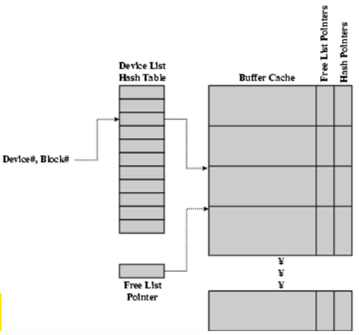

When the cache is full and we need to read another block into memory, we must choose and existing entry to replace. For this we need a policy to choose a victim e.g. first-in, first-out (FIFO), least-recently-used (LRU) or others.

### File System Consistency

File data is expected to survive. A strict LRU policy could keep modified critical data in memory forever if it is frequently used.

Generally, cached disk blocks are prioritised in terms of how critical they are to file system consistency.  
Directory blocks and inode blocks, if lost can corrupt entire file systems. e.g. imagine losing the root directory. These blocks are usually scheduled for immediate write to disk.  
Data blocks if lost corrupt only the file that they are associated with. These blocks are only scheduled for write back to disk periodically. In UNIX, `flushd` (flush daemon) flushes all modified blocks to disk every 30 seconds.

Alternatively, we can use a **write-through cache**; all modified blocks are written to disk immediately. This generates more disk traffic as temporary files are written back and multiple updates are not combined. This method is used by DOS. It gave okay consistency when floppy disks were removed from drives and when users were constantly resetting (or crashing) their machines. It is still used in USB storage devices.

# Case Study: ext2 File System

**ext2** for extended file system was the main Linux file system before ext3. It was evolved from the Minix file system.

Features of the file system:

* its block size (1024, 2048, and 4096) is configured at file system creation
* it is an inode-based file system
* has performance optimisations to improve locality (from BSD Fast File System (FFS))

The main problem with ext2 was that an unclean unmount (e.g. os crashes, power-loss etc.) would result the `e2fsck` file system checker running, which would take a long time to run for large storage capacities. The ext3 file system fixed this by keeping a journal of (meta-data) updates. The journal is a file where updates are logged.

## Recap: inodes

Each file is represented by an inode on disk. The inode contains the fundamental file metadata; access rights, owner, accounting info, (partial) block index table of a file etc.  
Each inode has a unique number; a system oriented name (try `ls -i` on Unix-based systems)  
Directories map file names to inode numbers; i.e. it maps human-oriented to system-oriented names


### ext2 inodes

ext2 inodes contain:

* mode - the type (e.g. regular file or directory) and access mode (e.g. rwxrwxrwx)
* uid - user ID
* guid - group ID
* atime - time of **last access**
* ctime - time when file was **created**
* mtime - time when file was **last modified**
* size - the offset of the **highest byte** written
* block count - the number of disk blocks used by the file. Note: that the number of blocks can be much less than expected given the file size. Files can be sparsely populated  
e.g. `write(f, "hello");lseek(f,1000000);write(f,"world");` only needs to store the start and end of the file, not all the empty blocks in between; so `size=1000005` and `blocks=2+any indirect blocks`
* reference count - see [hard links](#hard-links)
* direct blocks - see [below](#unix-inode-block-addressing-scheme)
* single indirect - see [below](#unix-inode-block-addressing-scheme)
* double indirect - see [below](#unix-inode-block-addressing-scheme)
* triple indirect - see [below](#unix-inode-block-addressing-scheme)

### Unix Inode Block Addressing Scheme

Direct blocks store the block numbers of the first 12 blocks in the file; we can find the blocks _directly_ from the inode


We store offsets greater than the 12 blocks using indirection.

**Single indirection** is where we store the block number of a block which contains block numbers where higher offsets are stored. It requires two disk accesses to read; one for the indirect block and one for the target block.  
Our max file size, assuming 1Kbyte block size and 4byte block numbers is `12*1K + 1K/4 *1K = 268KiB`.

In **double indirection** we store the block number of a block containing block numbers of blocks containing block numbers.

In **triple indirection** we store the block number of a block containing block numbers of blocks containing block numbers of blocks containing block numbers.

Visually that would look like this:


Example: assume we have 8 byte blocks, containing 4 byte block numbers. So we can store 2 block numbers in each block using a 1-bit index. Assume that we have a single direct block


Example: assume we have 4 byte block numbers and 1K blocks.

``` txt
The number of addressable blocks is  
direct blocks = 12  
single indirection = 256
double indirection = 256*256 = 65536
triple indirection = 256*256*256 = 16777216
So, max file size = 12 + 256 + 65536 + 16777216 = 16843020 blocks  16 GB
```

Example: where is the data block number stored?  
Assume we have 4K blocks, 4 byte block numbers and 12 direct blocks

``` C
// A 1 byte file is produced by
lseek(fd, 1048576, SEEK_SET); /* 1 megabyte */
write(fd, "x", 1);

// Then we add
lseek(fd, 5242880, SEEK_SET); /* 5 megabytes */
write(fd, "x", 1);
```

Solution: 4K blocks, and 4 byte block numbers, means we have 1024 block numbers in our indirect blocks (10-bit index)

| block # range                     | location           |
| ---                               | ---                |
| `0-11`                            | direct blocks      |
| `12-1035(12+1024)`                | single indirection |
| `1036-1049611(1035+1024*1024)`    | double indirection |
| `1049611-???`                     | triple indirection |


#### Best and Worst Cases

Assume the inodes are already in memory

Some best and worst case access patterns:

To read 1 byte:  
**best:** 1 access via a direct block  
**worst:** 4 accesses via the triple indirect block

To write 1 byte:  
**best:** 1 write via a direct block (with no previous content)  
**worst:** 4 reads (to get the previous contents of the block via triple indirection) + 1 write (to write the modified block back)

Worst case access patterns with unallocated indirect blocks

Worst to write 1 byte:

* 4 writes (3 indirect blocks; 1 data)
* 1 read, 4 writes (read-write 1 indirect, write 2, write 1 data)
* 2 reads, 3 writes (read 1 indirect, read-write 1 indirect, write 1; write 1 data)
* 3 reads, 2 writes (read 2, read-write 1; write 1 data)

Worst to read 1 byte

* if reading writes a zero-filled block on disk
* worst case is the same as write 1 byte
* if not, worst-case depends on how deep current indirect block tree is

### Summary

The inode (and indirect blocks) contain the on-disk metadata associated with a file. It contains the mode, owner and other bookkeeping details.
It is efficient at random and sequential access via _indexed allocation_. Small files, which is the majority of files, require only a single access. Larger files require progressively more disk accesses for random accesses, but sequential access is still efficient. It can support really large files via increasing levels of indirection.

## Storing Inodes and File System Layouts

The **System V Disk layout (s5fs)** contains the following section in its layout:

* **boot block** containing code to bootstrap the OS and get the machine running
* **super block** containing attributes of the file system itself. e.g. size, number of inodes, the start block of the inode array, the start of the data block area, the free inode list, free data block list etc.
* **inode array**
**data blocks**


Some issues with s5fs' layout:

* having inodes at the start of the disk and data blocks at the end of the disk means we can have long seek times; we must read the inode before reading data blocks
* only one super block - a corrupt super block means the entire file system is lost
* block allocation is sub-optimal - the consecutive free block list is created at file system format time. Allocation and de-allocation eventually **randomises** the list resulting in random allocation
* inode free list is also randomised over time - directory listing resulted in random inode access patterns

The **Berkeley Fast File System (FFS)** historically followed s5fs. It addressed most of the limitations of s5fs and ext2fs is mostly similar to it.

### ext2 File System Layout

The **ext2 file system** is partitioned as follows:


* a reserved boot block
* a collection of equally sized **block groups**, where all block groups have the same structure

Each block group has the following layout:


* **replicated** super blocks for `e2fsck`
* group descriptors
* bitmaps used to identify free inodes/blocks
* data blocks of the same number for all block groups

The advantage of this structure is that replication simplifies recovery and the proximity of inode tables and data blocks reduces seek time

#### Super Blocks

Super blocks contain the size of the file system, block size, and similar parameters. It also contains an overall (list?) of free inode and block counters.  
It has data indicating whether a file system check is needed:

* uncleanly mounted
* inconsistency
* certain number of mounts since last checked
* certain time expired since last check

It is also replicated to provide **redundancy** to aid **recoverability**

#### Group Descriptors

Group descriptors have:

* the location of bitmaps
* a counter for free blocks and inodes in this group
* the number of directories in the group

#### Performance Considerations

ext2's optimisations:

* block groups cluster related inodes and data blocks
* pre-allocation of blocks on write (up to 8 blocks); 8 bits in bit tables; better contiguity when there are concurrent writes
* aim to store files within a directory in the same group

## ext2 File System Directories


**Directories** are files of a special type; consider it a file of a special format, managed by the kernel that uses most of the same machinery to implement it.

Directories translate names to inode numbers. Directory entries are of variable length and entries can be deleted in place by having a special inode number, `0`, to mean "there is nothing here".

Suppose our directory contains the following:


### Hard Links

Inodes can have more than one name. This is known as having a **hard link**.

In our sample directory, inode 7 has three names; "f1", "file2" and "f3" all refer to inode 7.


We can have many names for the same inode. A count of references (the **reference count**) is kept in the inode.  
Adding a name (directory entry) referring to the inode increments the count and removing a name decrements the count. If the reference count is 0, then we have no names for the inode (it is unreachable) and we can delete the inode (i.e. the underlying file or directory)

When an inode has a positive reference count, the inode with still _exist_ despite one of its references being deleted.


### Symbolic Links

A **symbolic link** or **symlink** is a file that contains a reference to another file or directory.

It has its own inode and data block, which contains a path to the target file. A symlink is marked by a special file attribute, is transparent for some operations and can point across file system boundaries.

Symlinks can contain paths to other symlinks essentially creating a linked list. Issues arise when a cyclical list is created or when a stored path is invalid. To deal with an endless path lookup a symlink lookup limit is imposed.

### Deleting a Filename

When deleting a file name (e..g `rm file2`), we adjust the record length to skip to the next valid entry


## File System Reliability

In ext2, disk writes are buffered in RAM, so an OS crash or power outrage results in lost data.  
ext2 commits writes to the disk periodically (e..g every 30 seconds) and uses the `sync` command to force a file system flush. The file system operations are non-atomic, so a incomplete transaction can leave the file system in an inconsistent state.

Let us go through an example where we try to find the optimal order of actions for deleting an file to deal with an operating system crash.


It turns out there is no good ordering. :(

When the file system realises it has had an unclean unmount, it uses e2fsck to scan the disk and attempt to restore file system invariants. However this is inefficient.

A solution to this is journaling file systems like ext3.  
It keeps a journal of file system updates. Before performing and atomic update sequence, it writes it to the journal. On an unclean shutdown, it replays the last journal entries

# Case Study: ext3 File System

Specifically, a look at journaling in the ext3 file system.

The design goals of the ext3 file system was to:

* add journaling capability to the ext2 file system
* have backward and forward compatibility with ext2 so that existing ext2 partitions can be mounted as ext3
* leverage the proven ext2 performance
* reuse most of the ext2 code base
* reuse ext2 tools, including `e2fsck`

## The ext3 Journal

When journaling we can have two approaches:

**Option 1:** Journal file system data structure updates. Example:

``` txt
start transaction
    delete dir entry
    delete inode
    release blocks 32, 17, 60
end transaction
```

**Option 2:** Journal disk block updates. Example

``` txt
start transaction
    update block #n1 (contains the dir entry)
    update block #n2 (inode allocation bitmap)
    update block #n3 (data block allocation bitmap)
end transaction
```

ext3 implements option 2


### Journal Block Device (JBD)

The ext3 journal is called **Journaling Block Device (JBD)**.  
The JBD interface:

* **starts** a new transaction
* **updates** a disk block as part of a transaction
* **completes** a transaction; completed transactions are buffered in RAM
* **commits** (writes) transaction data to the journal (persistent storage); **multiple** file system transactions are committed in one go
* **checkpoint**; flush the journal to the disk; used when the journal is full or the file system is being mounted


The transaction lifestyle:


The JBD can keep the journal on a block device or in a file. This enables compatablity with ext2 (since the journal is just a normal file).

JBD is independent of ext3 specific data structures:

* separations of concerns - the file system maintains on-disk data and metadata; JBD takes care of journaling
* code reuse - JBD can be used by any other file system that requires journaling

### Journaling Modes

ext3 supports two journaling modes:

* **metadata + data** - enforces atomicity of all file system operations
* **metadata journaling** - only metadata is journalled; data blocks are written directly to the disk
    * improves performance
    * enforces file system integrity
    * does not enforce atomicity of `write`s (new file content can be stale blocks)

# Memory Management

Processes have one or more threads of execution and require resources for execution:

* Memory (RAM) - program code ("text"), data (initialised, uninitialised, stack), buffers held in the kernel on behalf of the process
* Others - CPU times, files, disk space, printers etc.

The operating system keeps track of what memory is in use and what memory is free. It allocates free memory to processes when needed and deallocates it when it isn't needed. It manages the transfer of memory between RAM and disk.

Ideally, programmers want memory that is **fast**, **large**, **non-volatile**. This is not possible. Memory management coordinates how the memory hierarchy is used, where the focus is usually on RAM to the disk.


There are two broad classes of memory management systems. Those that

* **transfer processes to and from external storage during execution** - called swapping or paging
* **do not transfer processes** - simple and usually found in embedded devices, dumb phones or smart cards.

## Basic Memory Management - Monoprogramming

This is monoprogramming without swapping or paging.

There are three simple ways of organising memory for an operating system with one user process.


This is okay if we only have one thing to do and the memory available approximately equates to memory required  
Otherwise, it has poor CPU utilisation in the presence of I/O waiting and poor memory utilisation with a varied job mix.

## Multiprogramming

Recall that an operating system aims to:

* maximise memory utilisation
* maximise CPU utilisation (ignoring battery/power management issues)

We can subdivide memory and run more than one process at once. This is known as multiprogramming or multitasking.


Given a workload, we need to keep track of free memory and locate free memory for a new process.

The overview of evolution of simple memory management:

* **static** (fixed partitioning) approaches - simple, predictable workloads of early computing
* **dynamic** (partitioning) approaches - more flexible computing as computing power and complexity increased

### Fixed Partitioning

**Approach 1:** divide memory into **_fixed equal-sized_** partitions. Any process smaller than or equal to the partition size can be loaded into any partition. Partitions are free or busy.

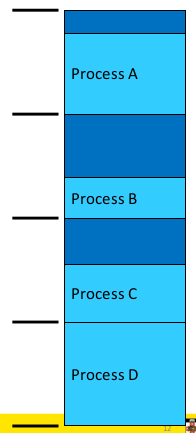

Any unused space in the partition is wasted (internal fragmentation). Processes smaller than main memory but larger than a partition cannot run.

**Approach 2:** **_fixed, variable-sized_** partitions. We divide memory at boot time into a selection of different sized partitions. We can base the sizes on expected workloads. Each partition has a queue. We place a process in the queue for the smallest partition that it fits in. Processes then wait for when the assigned partition is empty to start.

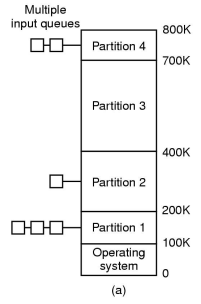

An issue here is that some partitions may be idle; we may have small jobs available and queued but a large partition free. Workloads are unpredictable and may not be efficiently used

**Approach 3:** **_fixed variable-sized_** partitions **_with a single queue_**. We have a single queue where we search for a partition that fits the job. This means small jobs may be allocated large partitions if necessary. However this increases internal memory fragmentation.

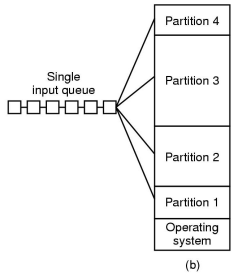

To summarise, fixed partitioning is simple and easy to implement. However it can result in poor memory utilisation due to internal fragmentations.

This approach is used on IBM System 360 operating system (OS/MFT) announced in 6 April, 1964. It is still applicable to simple embedded systems, where static workloads are known in advance.

### Dynamic Partitioning

In dynamic partitioning, partitions are of **_variable length_** and are allocated **_on-demand_** from ranges of free memory. A process is allocated exactly what it needs and it is assumed a process knows what it needs.


In the diagram above, we have 16MB free at (h), but it can't be used to run any more processes requiring more than 6MB as it is fragmented. Hence we have external fragmentation since we have unusable holes.

Dynamic partition allocation algorithms are also applicable to `malloc()` like in-application allocators.  
Given a region of memory, basic requirements are:

* quickly locate a free partition satisfying the request (minimise CPU time search)
* minimise external fragmentation
* minimise memory overhead of bookkeeping
* efficiently support merging two adjacent free partitions into a larger partition

A classic approach to keep track of free memory is to represent available memory as a linked list of available "holes" (free memory ranges). For each hole we store the base and size. We keep the holes in order of increasing address. This simplifies the merging of adjacent holes into larger holes. The list nodes are stored in the "holes" themselves.

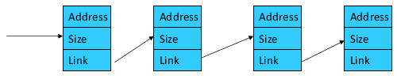

As a result there are four neighbour combinations for the terminating process X when we want to coalesce free partitions in a linked list.

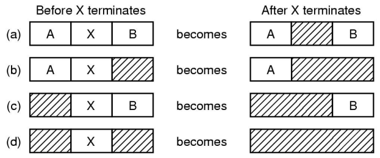

Dynamic partitioning placement algorithms using the list of "holes".

**Approach 1:** First-fit algorithm  
We scan the list for the first entry that fits. If the size is greater, we break it into an allocated and free part. The intent is to minimise the amount of searching performed.  
This aims to find a match quickly and biases allocation to the beginning of memory and tends to preserve larger blocks at the end of memory.

**Approach 2:** Next-fit algorithm  
Like first-fit, except it begins its search from the point in the list where the last request succeeded instead of at the beginning.  
This has (flawed) the intuition of spreading allocation more uniformly over the entire memory to avoid skipping over small holes at the start of memory. It performs worst that first-fit as it breaks up the large free space at the end of memory.

**Approach 3:** Best-fit algorithm  
Chooses the block that is closest in size to the request  
It performs worse that first-fit because it has to search the entire list. Since the smallest block is chosen for a process, the smallest amount of external fragmentation is left, creating a lot of unusable holes.

**Approach 4:** Worst-fit algorithm  
Chooses the block that is the largest in size (worst-fit). The idea is to leave a unusable fragment left over.  
It is also a poor performer since it has more work to do (like best-fit) to search the entire list. It also does not result in significantly less fragmentation.

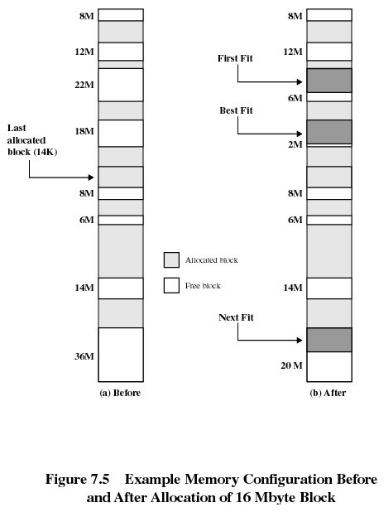

In summary, first-fit is generally a better solution than the others mentioned and it is easier to implement.  
They are simple solutions to still-existing operating systems or application services/functions for memory allocation.  
Note that they have largely been superseded by more complex and specific allocation strategies. Typically in-kernel allocators used are _lazy buddy_ and _slab allocators_

#### Compaction

We can reduce external fragmentation by compaction. That is we shuffle memory contents to place all free memory together in one large block. We can do this only if we can relocate running programs. This generally requires hardware support.

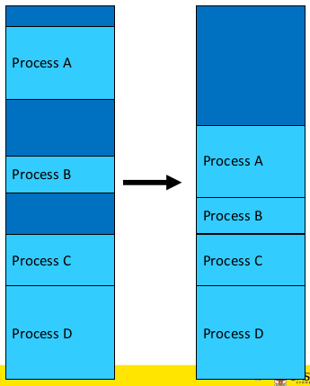

#### Relocation and Protection

We haven't addressed how a process runs in different locations in memory and how we prevent processes from interfering with each other.

To deal with this we have **logical addresses** refer to locations within the program. Once running, these addresses must refer to the real physical memory.


The logical addresses can be bound to physical memory at:

* **compile/link time** - the compiler/linker binds the address and must know the "run" location at compile time (in other words the executable contains the corresponding physical addresses for the process). This means we can only **_run one copy_** of the process and it can only **_run at one_** location. We need to recompile if the location changes
* **load time** - the compiler generates **_relocatable_** code. Addresses are annotated and the loader binds the address to the correct location at load time. This slows start up and increases the executable file size
* **run time** - logical compile-time addresses are translated to physical addresses by _special hardware_. The cost of translating every memory reference is high

##### Hardware Support for Runtime Binding and Protection

For process B to run using logical addresses, process B expects to access addresses from 0 to some limit of memory size. We need to add an appropriate offset to its logical adddress to achieve relocation and protect memory "lower" than B. We must also limit the maximum logical address B can generate to protect memory "higher" than B.


To deal with this we have **base and limit registers** (also called **base and bound registers** and **relocation and limit registers**. Base and limit registers restrict and relocate the currently active process. Base and limit registers must be changed at load time, relocation (compaction time) or on a context switch.


Pros include:

* supports protected multi-processing/multi-tasking

Cons include:

* physical memory allocation must still be contiguous
* the entire process must be in memory
* does not support spatial sharing of address space; no shared code, libraries, or data structures between processes

### Swapping

So far, we have a system suitable for a batch system; limited number of dynamically allocated processes enough to keep the CPU utilised; relocated at runtime; protected from each other.

We need more than just a small number of processes running at once. We need to support a mix of active and inactive processes of varying longevity

A process can be **swapped** temporarily out of memory to a **backing store** and then brought back into memory for continued execution.  
The **backing store** is a fast disk large enough to accommodate copies of all memory images for all users. It must provide direct access to these memory images.  
We can prioritised processes; lower-priority processes can be swapped out so that a higher-priority process can be loaded and executed.  
A major part of swap time is transfer time; the total transfer time is directly proportional to the _amount_ of memory swapped.

A schematic view of swapping:

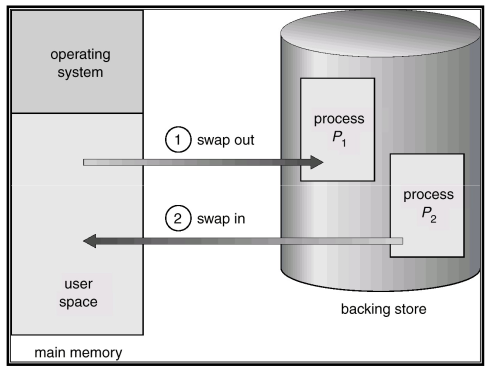

# Virtual Memory

## Introduction

**Virtual memory** was developed to address the issues identified with the simple schemes covered so far. There are two variants; paging and segmentation. Paging is now the dominant one of the two. Some architectures support hybrids of the two schemes; e.g. Intel 1A-32 (32-bit x86)

### Paging

In paging we partition physical memory into small equal sized chunks called ***frames***. We divide each process' virtual (logical) address space into same sized chunks called ***pages***. Virtual memory addresses consist of a _page number_ and _offset within the page_.

The operating system maintains a **page table**, which contains the frame location for each page. It is used by _hardware_ to translate each virtual address to a physical address. The relation between virtual addresses and physical memory addresses is given by the page table.

In paging the process' physical memory does **not** have to be contiguous.


The assignment of process pages to free frames:


Paging has no external fragmentation, although it will have a small amount of internal fragmentation (especially for the last page). It allows sharing by _mapping_ several pages to the same frame. Paging abstracts physical organisation since the programmer only deals with virtual addresses. There is minimal support for logical operations since each unit if one or more pages.

### Memory Management Unit (MMU)

The **Memory Management Unit (MMU)** is also called **Translations Look-aside Buffer (TLB)**
It is connected to the CPU, which sends virtual addresses to the MMU. The MMU translates the given logical addresses to physical address in memory.


MMU Operation:


More information about the MMU will be discussed [later](#Translation-Look-aside-Buffer)

## Overview

**Virtual memory** is divided into equal sized **_pages_**.  
A ***mapping*** is a translation between a page and a frame, and a page and null. Mappings are defined at runtime, although they can change.  
The address space can have holes.  
The process does not have to be contiguous in physical memory

The **physical memory** is divided into **_frames_**.


A typical address space layout consists of:

* the stack region at the top, growing down
* the heap as free space, growing up
* text as (typically) read-only
* the kernel reserved and protected as a shared region

The 0th page is typically not used as `NULL` pointers generally point to this address and if accessed can be successfully dereferenced.


A process may be only partially resident (i.e. loaded to the physical address space). This allows the OS to store individual pages on disk and saves memory for infrequently used data and code


If we access non-resident memory, we will get a **page fault**. This occurs when we reference an invalid page and is an exception handled by the OS.  
Broadly there are two standard page fault types:

* **illegal address** (protection error) - signals or kills the process
* **page not resident** - will
    1. get an empty frame
    2. load the page
    3. update the page (translation) table (enter frame#, set valid bit, etc.)
    4. restart the faulting instruction

A page table for resident parts of the address space:


### Shared pages

Generally each process has their own copy of code and data, which can appear anywhere in the address space. It is possible to have shared code (e.g. a system library) where a single copy of code is shared between all processes executing it. The code itself **must not be self modifying** and **must appear at the same address in all processes**

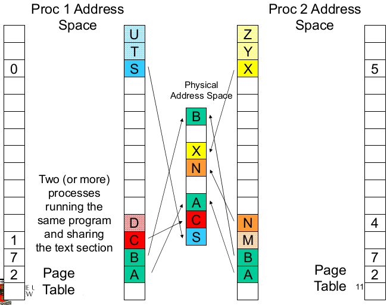

### Page Table Structure

A **page table** is (logically) an array of frame numbers indexed by a page number. Each **page-table entry (PTE)** also has other bits:

* **present/absent bit** - also called a **valid bit**, which indicated a valid mapping for the page
* **modified bit** - also called a **dirty bit**, which indicates that a page may have been modified in memory; useful for loading blocks from disk; e.g. if a block has not been modified, we do not need to retrieve it from the disk
* **reference bit** -  indicates the page has been accessed; useful for choosing which pages to remove
* **protection bit** - a combination of read, write, execute permissions
* **caching bit** - used to indicate whether the processor should bypass the cache when accessing memory; e.g. to access device registers or memory

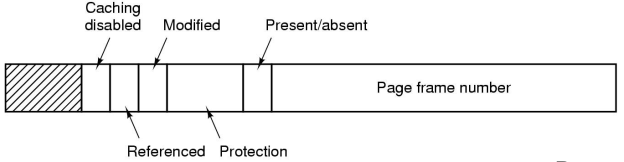

### Address Translation

Every (virtual) memory address issued by the CPU must be translated to physical memory; every _load_ and every _store_ instruction, every instruction fetch. To be able to do this be need translation hardware.

In the paging system, translation involves replacing the page number with a frame number.

### Overview Summary

Virtual and physical memory are 'chopped' into equal sized pages and frames respectively.

Programs use **virtual** addresses, which are mapped to physical addressed by the Memory Management Unit (MMU).

It first checks if the page is present (present/absent but).  
If **yes**, the address in the page table form MSBs in physical address  
If **no**, trigger a page fault and bring in the page from disk


## Page Tables

Assume we have:

* a 32-bit virtual address (2^32 = 4 Gbyte address space)
* 4 Kbyte page size

We would have `2^32 / 2^12 = 2^20` page table entries each with a `2^12` offset.

Now, assume we have:

* a 62-bit virtual address space (a humongous address space)
* 4 Kbyte page size

We would have `2^64 / 2^12 = 2^52` page table entries.

Our page table would be **very** large.

Page tables are implemented as data structures in main memory. Most processes do not use the full 4GB address space; e.g. 0.1  1 MB text, 0.1  10 MB data, 0.1 MB stack

We need a compact representation that does not waste space, but is still very fast to search. There are three basic schemes:

* use data structure that adapt to sparsity
* use data structures which only represent resident pages
* use VM techniques for page tables (covered in extended OS)

### Two-level Page Table

The **two-level page table** is a page table which adapts to sparsity. Unmapped pages are not allocated.

Instead of accessing the page table via a single page number, we split the page number into high-order and low-order bits, and use those bits to index the **top-level** and **second-level** page tables respectively

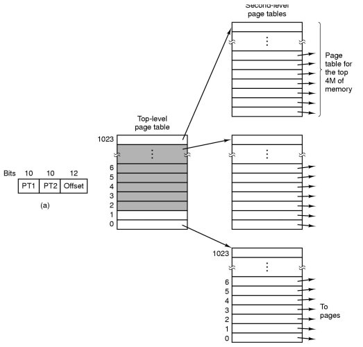

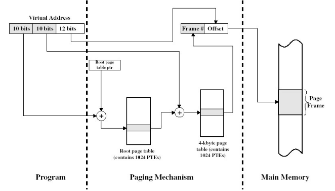

### Inverted Page Table

An **inverted page table (IPT)** has an array of page numbers indexed by frame numbers (it's a frame table).

The algorithm:

1. Compute the hash of a page number
2. Extract the index from the hash table
3. Use this index in the inverted page table
4. Match the PID and page number in the IPT entry
    1. If it matches, use the index value as the frame number fro translation
    2. If it doesn't match, get the next candidate IPT entry from the chain field
    3. If`NULL` chain entry, trigger a page fault


Properties of inverted page tables:

* grows with the size of RAM, **NOT** with the virtual address space
* frame table is needed anyway (for page replacement)
* need a separate data structure for non-resident pages
* saves a vast amount of space (especially on 64-bit systems)
* used in some IBM and HP work stations

### Comparing Two-Level and Inverted Page Tables

Given _n_ processes, a 'normal' page table would have _n_ page table while an inverted page table would only have _1_

Sharing a page is 'easy' for normal page table, but troublesome to implement for inverted page tables.

### Hashed Page Table

We can improve the IPT with a **hashed paged table (HPT)**. It retains the fast lookup of IPT (a single memory reference in the best case) and retains the page table sized on physical (not virtual) memory size, while enabling efficient frame sharing and support for more than one mapping for the same frame.

Instead of obtaining a frame number from the hash function, it obtains an index to the page table which **contains** the physical frame number.


HPT size is generally based on physical memory size. With sharing, each frame can have more than one page table entry. More sharing increases the number of slots used (but also increases the likelihood of collision). We can tune the HPT size based on:

* physical memory size
* expected sharing
* hash collision avoidance

## VM Implementation Issues

Each virtual memory reference can cause two physical memory accesses; one to fetch/store the page table entry, one to fetch/store the data. This can have a significant impact on performance

A solution to this would be a high-speed cache for page table entries (PTEs) called a **translation look-aside buffer (TLB)**. It contains recently used page table entries. It is similar to cache memory and may be under the OS control (unlike memory cache)

## Translation Look-aside Buffer

Given a virtual address, the processor examines the TLB.

1. If a matching PTE is found (a _TLB hit_), the address is translated.
2. Otherwise (a _TLB miss_), the page number is used to index the process's page table.
    1. If the page table contains a valid entry, reload the TLB and restart
    2. Otherwise (page fault), check if the page is on disk
        1. If on disk, swap it in
        2. Otherwise, allocate a new page or raise an exception

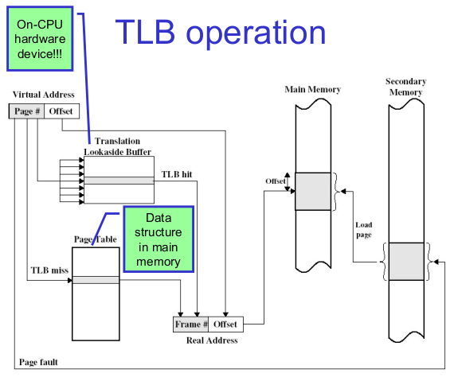

TLB properties:

* page table is (logically) an array of frame numbers
* TLB holds a (recently used) subset of page table entries
    * each TLB entry must be identified (tagged) with the page number it translates
    * access is by associative lookup; all TLB entries' tags are concurrently compared to the page number; TLB is associative (or content-addressable) memory
* may or may not be under direct OS control:
    * hardware-loaded TLB - on miss, hardware performs page table lookup and reloads TLB; e.g. x86, ARM
    * software-loaded TLB - on miss, hardware generates a TLB miss execption, and exception handler reloads TLB; e.g. MIPS, Itanium (optionally)
* TLB size is typically 64-128 entries
* can have separate TLBs for instruction fetch and data access
* TLBs can also be used with inverted page tables (and others)

Without TLB, the average number of physical memory references per virtual memory reference is `2`.  
With TLB (assuming there is a 99% hit ratio), the average number of physical memory references per virtual reference is `0.99*1 + 0.01*2 = 1.01`

### TLB and Context Switching

TLB is a shared piece of hardware. Normal page tables are per-process (address space). TLB entries are _process-specific_. On a context switch, we can

* **flush** the TLB (invalidate all entries) at the cost of high context-switching ovehead (e.g. Intel x86)
* tag entries with **address-space ID (ASID** - called a _tagged TLB_; used (in some form) on all modern architectures  
TLB entry contains: ASID, page#, frame#, valid and write-protect bits

## Recap -Simplified Components of Virtual Memory System

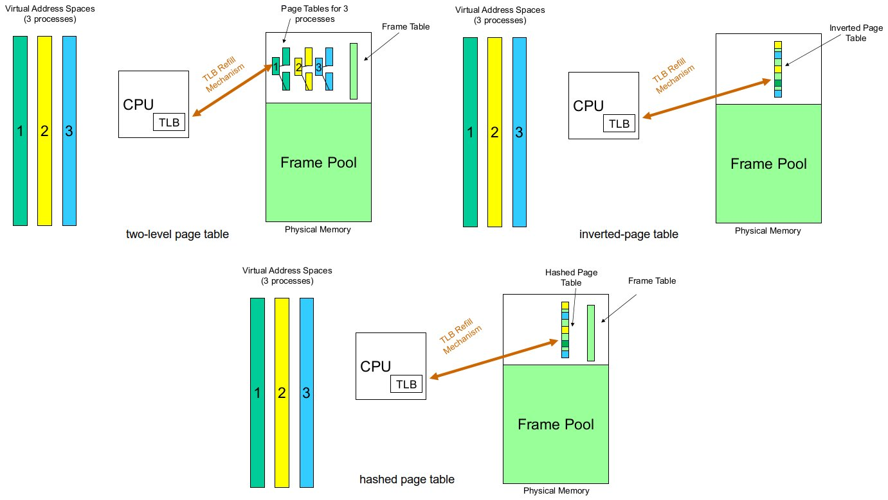

## MIPS R3000

TLB in MIPS R3000:


R3000 Address Space Layout:


# Virtual Memory ctd.

## TLB Recap

TLB may or may not be under the operating system's control

* Hardware-loaded TLB - on a miss, hardware performs a page table lookup and reloads the TLB; e.g. Pentium
* Software-loaded TLB - on a miss, hardware generates a TLB miss exception, and exception handler reloads the TLB; e.g. MIPS

Even if the TLB is filled by software, it is still a hardware-based translator

## Amdahl's Law

**Amdahl's law** states that overall performance improvement is limited by the fraction of time an enhancement can be used.


So the goal is to **make common cases FAST**

## MIPS R3000 TLB Handling

TLB refill is handled by software (an exception handler)

TLB refill exceptions are accessing `kuseg` are expected to be frequent so the CPU is optimised for handling `kuseg` TLB refills by having a special exception handler just for TLB refills


The special exception vector is optimised for TLB refills since it:

* does not need to check the exception type (since it has its own handler)
* does not need to save any registers; it uses a specialised assembly routine that only uses `k0` and `k1`
* does not check if the page table entry exists; assumes a virtual linear array (see extended OS if interested)

With careful data structure choice, the exception handler can be very fast

An example routine:

``` assembly
mfc0  k1, C0_CONTEXT
mfc0  k0, C0_EPC # mfc0 delay slot

lw    k1, 0(k0) # may double fault (k0 = orig EPC)
nop
mtc0  k1, Co_ENTRYLO
nop
tlbwr
jr    k0
rfe
```

MIPS virtual memory related exceptions:

* TLB refill - handled via special exception vector; needs to be very fast
* others - handled by the general exception vector; can be slower as they are mostly caused by an error, or non-resident page
    * TLB Mod- TLB modify exception; attempt to write to a read-only page
    * TLB Load- attempt to load from a page with an invalid translation
    * TLB Store- attempt to store to a page with an invalid translation

We never optimise for errors, and page-loads from disk. They dominate the fault resolution cost (see [Amdahl's law](#Amdahl's-Law))

### c0 Registers

* `c0_EPC` - stores the address of where to restart after the exception
* `c0_status` - stores kernel/user mode bits; interrupt control
* `c0_cause` - stores what caused the exception
* `c0_badvaddr` - stores the address of the fault

If `c0_EPC` and `c0_badvaddr` are the **same** then the page for the next instruction was not loaded  
If `c0_EPC` and `c0_badvaddr` are the **same** then it is likely to be an load/store failure

`c0` Registers are used to read and write individual TLB entries. Each TLB entry contains:

* `EntryHi` to match the page# and ASID
* `EntryLo` which contains the frame# and protection


MIPS' `c0` Registers:

* `N` for not cachable
* `D` for dirty (i.e write protect)
* `G` for gloabl (ignore ASID in lookup)
* `V` for valid bit

There are 64 TLB entries, and they are accessed via software through coprocessor 0 registers (`EntryHi`, `EntryLo`)

**MIPS TLB Translation**:  
You are given a virtual address in format `0x????????` and address space (ASID) `0x00000200`  
The TLB has the format:

``` txt
         TLB
EntryHi     EntryLo
0x00028200  0x0063f400
0x00034200  0x001fc600
0x0005b200  0x002af200
0x0008a100  0x00145600
0x0005c100  0x006a8700
0x0001c200  0x00a97600
```

1. Find an `EntryHi`entry in the TLB where the first 5 digits match your virtual address (the first 5 digits represent the page number)
2. Check the ASID matches your given ASID (i.e the last 3 digits match)
3. Check the flag bits in the `EntryLo` mapping of the TLB (i.e the 6th bit)
    1. If the valid bit is **not** set, the mapping is **invalid**
    2. If the ASID does not match and the global bit is not set, the mapping is **invalid**
    3. Otherwise, the mapping is **valid**
4. If the mapping is valid, the physical address is the first 5 digits of `EntryLo` (the frame number) and the last 3 digits of your virtual address (the offset)

The `c0_Index` register is used as an index to TLB entries. Single TLB entries are manipulated/viewed through `EntryHi` and `EntryLo` registers. The index register specifies which TLB entry to change/view

Special TLB management instructions:

* `TLBR` for TLB read - `EntryHi` and `EntryLo` are loaded from the entry pointer by the index register
* `TLBP` for TLB probe - sets `EntryHi` to the entry you wish to match; index register is loaded with the index to the matching entry
* `TLBWR` - write `EntryHi` and `EntryLo` to a pseudo-random location in the TLB
* `TLBWI` - write `EntryHi` and `EntryLo` to the location in the TLB pointed to by the index register

Example of coprocessor 0 registers on a refill exception:

``` tct
c0.EPC           = PC
c0.cause.ExcCode = TLBL; if read fault
c0.cause.ExcCode = TLBS; if write fault
c0.BadVaddr      = faulting address
c0.EntryHi.VPN   = page number of faulting address
c0.status        = kernel mode, interrupts disabled
c0.PC            = 0x8000 000
```

### Outline of TLB Miss Handling

Software does:

* lookup of page table entry corresponding to faulting address
* If found:
    * load `c0_EntryLo` with translation
    * load TLB with `TLBWR`instruction
    * return from exception
* else, page fault

The TLB entry (i.e. `c0_EntryLo`) can be (theoretically) created on the fly or stored completely in the right format in the page table (the latter being more efficient)

**OS/161 Refill handling**:  
After switching to the kernel stack, it simply calls the common exception handler

* stacks all registers
* can (and does) call `C` code
* unoptimised
* goal is ease of kernel programming, not efficiency

It does not have a page table. It uses the 64 TLB entries and then panics when it runs out. It only supports 256K user-level address space

## Demand Paging/Segmentation

With virtual memory, only parts of the program image need to be resident in memory for execution. We can transfer presently unused pages/segments to disk and then reload non-resident pages/segments on **demand**

A **reload** is triggered by a page or segment fault. The faulting process is blocked and another is scheduled. When the page/segment is resident, the faulting process is restarted.  
This may require freeing up memory first, where we replace a current resident page/segment (the replacement "victim"). If the victim is unmodified ("clean") we can simply discard it. This is the reason for maintaining a "dirty" bit in the page table.

Why does demand paging/segmentation work?  
We know a program executes at full speed only when accessing the resident set. TLB misses and page/segment fault introduce delays of several microseconds.  
**Answer**:

* less physical memory is required per process and we can fit more processes in memory. This results in an improved chance of finding a runnable one.
* principle of locality

## Principle of Locality

It was observed that programs tend to reuse data and instructions they have recently used; 90/10 rule - _"A program spends 90% of its time in 10% of its code"_

We can exploit this _locality of refences_

An implication of locality is that we can reasonably **predict what instructions and data a program will use** in the near future **based on its accesses in the recent past**

Two different types of locality have been observed:

* **temporal locality** states that recently accessed items are likely to be accessed in the near future
* **spatial locality** states that items whose addresses are near one another tend to be referenced close together in time

Locality in a memory-reference patter for `gcc`


## Working Sets

The pages/segments required by an application in a time window () is called its memory **working set**

A working set is an approximation of a program's locality. If

*  is too small, it will not encompass entire locality
*  is too big, it will encompass several localities
*  = , it will encompass the entire program

's size is an **application specific trade-off**

The system should keep resident at least a process's working set. The process executes while it remains in its working set.

The working set tends to change gradually since we tend to only get a few page/segment faults during a time window. It is possible (but hard) to make intelligent guesses about which pieces will be needed in the future

In `gcc`'s memory reference pattern, the working set is the page numbers loaded at a point of execution time


## Thrashing

CPU utilisation tends to increase with the degree of multiprogramming (the number of processes in the system). _Higher degrees of multiprogramming means less memory available per process_.

Some process' working sets may no longer fit in RAM. This implies and increasing page fault rate. Eventually many processes have insufficient memory and can't find a runnable process. This results in decreased CPU utilisation, and the system being I/O limited. This is known as **thrashing**


Why does thrashing occur?  
 working set sizes > total physical memory size

In the presence of increasing page fault frequency and decreasing CPU utilisation:

1. suspend a few processes to reduce the degree of multiprogramming
2. resident pages of suspended processes will migrate to a backing store
3. more physical memory becomes available; less faults, faster process for runnable processes
4. resume suspended processes later when memory pressure eases

## Virtual Memory Management Policies

Operation and performance of VM systems is dependent on a number of policies:

* page table format (may be dictated by hardware); e.g multi-level, inverted/hashed
* page-size (may be dictated by hardware)
* fetch policy
* replacement policy
* resident set size; minimum allocation and local vs. global allocation
* page cleaning policy

### Page Size

Increasing page size:  
 decreases number of pages - reduces size of page tables  
 increases TLB coverage - reduces number of TLB misses  
 increases swapping I/O throughput - small I/O are dominated by seek/rotation delays  
x increases internal fragmentation - reduces the adaptability to working set size  
x increases page fault latency - need to read more from disk before restarting process

The optimal page size is a (work-load dependent) trade-off

Generally, the working set size increases with the page size.

Processors and their page sizes:


Multiple page sizes provides flexibility to optimise the use of the TLB. For example, large page sizes can be used for code, while small page sizes can be used for thread stacks. Most operating systems support only a single page size, since it is difficult to deal with multiple page sizes

### Fetch Policy

**Fetch Policy** determines _when_ a page should be brought in to memory.

**_Demand paging_** only loads pages in response to page faults. There will be many page faults when a process first starts  
**_Pre-paging_** brings in more pages than needed at the moment. It will pre-fetch when the disk is idle. This improves I/O performance by reading in larger chunks. However, it wastes I/O bandwidth if the pre-fetched pages aren't used. It is especially bad if we eject pages in the working set in order to pre-fetch unused pages.

The pre-paging is difficult to get right in practice and demand paging is often used instead of it.

### Replacement Policy

Replacement policy decides which page to remove from the page table, when we need to load a non-resident page.

The page removed should be the page least likely to be referenced in the near future. Most policies attempt to predict the future based on past behaviour

Constraints:

* kernel code
* main kernel data structures
* I/O buffers
* performance-critical user-pages (e.g. for DBMS)

For the above the frame table has a **lock** (or **pinned**) bit

#### _Optimal_ Replacement Policy

The **_optimal_ replacement policy** tosses the page that won't be used for the longest time. However, this is **impossible** to implement. It is only good as a theoretical reference point. The closer a practical algorithm gets to _optimal_ the better

For example, we have the following reference string `1, 2, 3, 4, 1, 2, 5, 1, 2, 3, 4, 5` and can only load 4 frames at a time. The amount of page faults generated is 6.

#### FIFO Replacement Policy

**First-in, first-out (FIFO)** tosses the oldest page. It is easy to implement but the age of a page is not necessarily related to it usage.

For example, we have the following reference string `1, 2, 3, 4, 1, 2, 5, 1, 2, 3, 4, 5` and can only load 4 frames at a time. The amount of page faults generated is 10.

#### Least Recently Used (LRU)

**Least Recently Used (LRU)** tosses the least recently used page. It assumes that the page that has not been referenced for a long time is unlikely to be referenced in the near future. It works well if locality holds.

The implementation requires a time stamp to be kept for each page, which is updated **on every reference**. It is impossible to implement efficiently since it would require specialist hardware to update the time stamp for every single memory reference.

For example, we have the following reference string `1, 2, 3, 4, 1, 2, 5, 1, 2, 3, 4, 5` and can only load 4 frames at a time. The amount of page faults generated is 8.

#### Clock Page Replacement

The **clock policy** also called **second chance** employs a _usage_ or _reference_ bit in the frame table. A frame is set to `1` when the page is used. While scanning for a victim, reset all the reference bits to `0`. We toss the first page with a `0` reference bit.


How do we know when a page is referenced in software?  
We use the valid bit in the page table entry. When a page is mapped (valid bit set), set the "reference" bit. When resetting the reference bit, invalidate the page table entry. On a page fault, turn on the valid bit in the page table entry equates to turning on the reference bit. Thus, we simulate a reference bit in software.


#### Policy Performance

In terms of selecting the most appropriate replacement policy, they rank as follows

1. Optimal
2. LRU
3. Clock
4. FIFO

Note that there are other algorithms (Working Set, WSclock, Ageing, NFU, NRU)

### Resident Set Size

Resident set size concerns how many frames each process should have.

We can have a **fixed allocation**, which gives a process a fixed number of pages within which to execute. This isolates process memory usage from each other. When a page fault occurs, one of the pages of that process must be replaced. Achieving high utilisation is an issue here since some processes have high fault rate while others use their full allocation.

We can also have **variable allocation**, where the number of pages allocated to a process varies over the lifetime of the process.  

There is **variable allocation with a global scope**. The operating system keeps a global list of free frames. A free frame is added to a resident set of a process when a page fault occurs. If there is no free frame, it replaces one from any process. It provides automatic balancing across the system but does not provide guarantees for important activities. This is the easiest and adopted by many operating systems.

There is also **variable allocation with a local scope**. This allocated the number of page frames to a new process based on

* application type
* program request
* other criteria (e.g. priority)

When a page fault occurs, we select a page from among the resident set of the process that suffers the page fault. We will have to _re-evaluate allocation from time to time_

Our allocations will have to establish an "acceptable" page-fault rate.  
If the actual rate is too low, the process loses a frame  
If the actual rate is too high, the process gains a frame

### Cleaning Policy

It's been observed that clean pages are much cheaper to replace than dirty pages.

In **demand cleaning** a page is written out only when it has been selected for replacement. There is a  high latency between the decision to replace and availability of free frame.

In **precleaning**, pages are written out in batches (in the background, the _pagedaemon_). It increases the likelihood of replacing clean frames. This also overlaps I/O with the current activity.

# Multiprocessors

We will look at **shared-memory multiprocessors** (i.e when multiple processors share the same memory. A single CPU can only go so fast. If we use more than one CPU, it is possible to improve performance. This is based on the assumption that workload can be parallelised and is not I/O bound or memory bound.

Recall **Amdahl's Law**, where given a portion _P_ of a program that can be made parallel, and the remaining portion _(1-P)_, sped up by using _N_ processors

The speedup is %2B%5Cfrac%7BP%7D%7BN%7D%7D)

Given a program, which runs in serial 50% of the time and in parallel for the other 50%, If we use 2 processor the speed up becomes 


If the number of processors tends towards infinity, the speed up becomes 


Types of multiprocessors:

* UMA MP (**Uniform Memory Access**) - access to all memory occurs at the same speed for all processors
* NUMA MP (**Non-uniform Memory Access**) - access to some parts of memory is faster for some processors than other parts of memory

We will be focusing on UMA multiprocessors

## Bus Based UMA

A **Bus Based UMA** is the simplest multiprocessor, where more than one processor is on a single bus connected to memory. The bus bandwidth becomes a bottle neck with more than just a few CPUs.

Each processor has a cache to reduce its need to access to memory. The hope is that most accesses are to the local cache. Even so, the bus bandwidth still becomes a bottle neck with many CPUs.


With caches comes the problem of cache consistency. If one CPU writes to address `0x1234` (and it is stored in its cache) and another CPU reads from the same address (and gets what is in its cache), the values will be inconsistent.

**Cache consistency** is usually handled by the hardware. Writes to one cache propagate to, or invalidate appropriate entries on other caches. These cache transactions also consume bus bandwidth.


With only a single shared bus, scalability can be limited by the bus bandwidth of the single bus, even with the help of caching. Alternative bus architectures do exist; they do improve the bandwidth available, but do not eliminate the constraint that the bandwidth is limited

Another bus architecture: multi-core processor


In summary, multiprocessors can increase computation power beyond that available from a single CPU. It shares resources such as disk and memory.  
However, it works under the assumption that parallelisable workload is effective and not I/O bound. The shared buses (bus bandwidth) limits scalability, but can be reduced via hardware design, and by carefully crafting software behaviour. E.g. good cache locality together with limited sharing where possible

## Operating Systems for Multiprocessors

### An OS per CPU

In this each CPU has its own OS. They statically allocate physical memory to each CPU and each CPU runts its on independent OS. Peripherals are shared, but each CPU (OS) handles its process system calls.


This was used in early multiprocessor systems to "get them going". It has the following features

* **simple** to implement
* **avoids** CPU-based **concurrency issues** by not sharing
* **scales** - no shared serial sections

It is a modern analogy to virtualisation in the cloud

It does that have following issues though:

* each processor has its own scheduling queue; we can have one processor overloaded and the rest idle
* each processor has its own memory partition; he can have one processor thrashing, and the others free with memory; there is no way to move free memory from one OS to another

### Symmetric Multiprocessors

In **Symmetric Multiprocessors (SMP)**, the OS kernel runs on all processors. The load and resources are balanced between all processors (including kernel execution).


The issue of **concurrency in the kernel** arises. We need carefully applied synchronisation primitives to avoid disaster.

**Solution 1**: a single mutex that will make the **entire** kernel a critical section  
Only one CPU can be in the kernel at any time. The "big lock" becomes a bottleneck when in-kernel processing exceeds what can be done on a single CPU.

**Solution 2**: identify large independent parts of the kernel and make each of them their own critical section  
This allows for more parallelism in the kernel.  
It is difficult to implement since the code is mostly similar to uniprocessor code. The hard part is identifying independent parts that don't interfere with each other (recall the [spaghetti monster](https://github.com/hillaryychan/COMP3231/blob/master/imgs/1-22_monolithic-os-structures.jpg) of inter-dependencies between OS subsystems)

Example: associate a mutex with independent parts of the kernel. Some kernel activities require more than one part of the kernel. This means we will need to acquire more than one mutex, which is _great_ opportunity to deadlock.  
Overall, it results in a potentially complex lock ordering scheme that must be adhered to.

Example: given a "big lock" kernel, we divide the kernel into two independent parts with a lock each. There is a good chance that one of those locks will become the next bottleneck. This leads to more subdivision, more locks, and more complex lock acquisition rules. Subdivisions in practice is making more code multithreaded (parallelised)

An example in real life covering scalability:

Early 1990s, CSE wanted to run 80 X-Terminals off one or more server machines.  
The winning tender was a 4-CPU bar-fridge-sized machine with 256M of RAM. This was eventually configured to 6-CPU and 512M of RAM. The machine ran fine in all pre-session testing.  
However the combination of students and assignment deadlines made the machine unusable.

To fix the problem, the tenderer supplied more CPUs (increasing the number to 8) to improve performance, yet there was no change.

Eventually, the machine was replaced with three 2-CPU pizza-box-sized machines, each with 256M RAM. It was cheaper overall and performance improved dramatically. **Why?**  

The 4-8 CPU machine hit a bottleneck in the single threaded virtual memory code. Adding more CPUs simple added them to the wait queue for the virtual memory locks and made other wait longer.  
The 2 CPU machines did not generate that much lock contention and performed proportionally better

**Lessons**: building scalable multiprocessor kernels is hard; lock contention can limit overall system performance

It should also be noted that SMP Linux followed a similar evolution

* Linux 2.0 Single kernel big lock (1996)
* Linux 2.2 Big lock with interrupt handling locks
* Linux 2.4 Big lock plus some subsystem locks
* Linux 2.6 most code now outside the big lock, data-based locking, lots of scalability tuning, etc, etc..
* Big lock removed in 2011 in kernel version 2.6.39

## Multiprocessor Synchronisation

To achieve synchronisation on a multiprocessor machine, we cannot simply disable interrupts like we do in uniprocessors. This does not prevent other CPUs from running in parallel. We need special hardware support.

Recall the mutual exclusion via test-and-set:

``` assembly
enter region:
    TSL REGISTER,LOCK   | copy lock to register and set lock to 1
    CMP REGISTER,#0     | was lock zero?
    JNE enter_region    | if it was non-zero, lock was set, so loop
    RET                 | return to caller; critical region entered

leave_region:
    MOVE LOCK,#0        | store a 0 in lock
    RET                 | return to caller
```

Hardware guarantees that the instruction execute atomically on a CPU, but this does not work on a SMP without some extra hardware support.


A solution would be to have hardware block all other CPUs from accessing the bus during the TSL instruction to prevent memory accesses by any other CPU. TSL has mutually exclusive access to the memory for the duration of the instruction

### Bus Contention

Test-and-Set is a busy-wait synchronisation primitive called a **spinlock**. **Lock contention** leads to spinning on the lock. Spinning on a lock requires blocking the bus which slows all other CPUs down, independent f whether other CPUs need a lock or not. This causes **bus contention**

Caching does not help reduce bus contention either. Either TSL still blocks the bus or TSL requires exclusive access to an entry in the local cache.  
This requires invalidation of the same entry in other caches, and loading the entry into the local cache.  
Many CPUs performing TSL simply bounce a single exclusive entry between all caches using the bus

We can use the following to reduce bus contention:

``` C
start:
    while (lock == 1);  // spin read the lock variable waiting for it to change
    r= TSL(lock);       // when it does, use TSL to acquire the lock
    if (r == 1)
        goto start;
```

This allows the lock to be shared read-only in all caches until it is realised. There is no bus traffic until the actual release. There are no new race conditions, since acquisition is still with TSL.

### Comparing Simple Spinlocks

Thomas Anderson, The Performance of Spin Lock Alternatives for Shared-Memory Multiprocessors, IEEE Transactions on Parallel and Distributed Systems, Vol 1, No. 1, 1990 compares simple spinlocks

``` C
// Test and Set
void lock (volatile lock_t *l) {
    while (test_and_set(l)) ;
}

// Read before Test and Set
void lock (volatile lock_t *l) {
    while (*l == BUSY || test_and_set(l)) ;
}
```

It used the above spinlocks on the following code

``` C
for i = 1 .. 1,000,000 {
    lock(l);
    crit_section();
    unlock();
    compute();
}
```

`compute` was chosen from uniform random distribution of mean 5 times critical section. It measured elapsed time on Sequent Symmetry (20 CPU 30386, coherent write-back invalidate caches)

The following results were received:


* Test-and-Set performs poorly once there is enough CPUs to cause contention for the lock
* Read before Test-and-Set performs better; performance is less than expected; there is still significant contention when CPUs notice release and all attempt acquisition
* Critical section performance degenerates
    * critical section requires bus traffic to modify shared structures
    * lock holder competes with CPU that's waiting as they test-and-set so the lock holder is slower
    * slower lock holder results in more contention

### Spinning Locks vs. Blocking Locks

Uniprocessor: Spinning vs Blocking


Spinning (busy-waiting) on a lock makes no sense on a uniprocessor. There was no other running process to release the lock. Blocking and (eventually) switching to the other lock holder is the only sensible option.

On SMP systems, the decision to spin or block is not as clear. The lock is held by another running CPU and will be freed without necessarily switching away from the requester


Blocking and switching to another process takes time; we need to save context and restore another. The cache contains the current process not the new process and adjusting the cache working set also takes time. The same applies to TLB. Switching back when the lock is free encounters the same issue.

Spinning wastes CPU time directly.

If the lock is held for less time than the overhead of switching to and back, it is more effective to spin. Spin locks expect critical sections to be short; no waiting for I/O within a spinlock, no nesting locks within a spinlock

When the spinlock holder is pre-empted at the end of the holder's time slice, mutual exclusion is still guaranteed. Other CPUs will spin until the holder is scheduled again.

Spinlock implementations generally disable interrupts in addition to acquiring locks to avoid lock-holder pre-emption

# Scheduling

On a multi-programmed system, we may have more than one _ready_ process  
On a batch system, we may have my jobs waiting to be run  
On a multi-user system, we may have many users concurrently using the system

The **scheduler** decides who to run next. The process of choosing is called **scheduling**.

Scheduling is not important in certain scenarios:

* if you have no choice - early systems usually use batching, where the scheduling algorithm is simple; run next on tape, or next on punch tape
* only one thing to run - simple PCs only ran a word processor etc., simple embedded systems (e.g. TV remote control, washing machine, etc.)

It is important in most realistic scenarios:

* multi-tasking/multi-user system -  e.g. an email daemon takes 2 seconds to process an email and the user clicks a button on the application
    * scenario 1: run daemon, then application -appears sluggish to user
    * scenario 2: run application, then daemon - application appears really responsive, small email delay is unnoticed

Scheduling decisions can have a dramatic effect on perceived performance of the system. It can also affect the correctness of a system with deadlines.

## Application Behaviour

Applications tend to have bursts of CPU usage alternating with periods of I/O wait. A process can be a


* CPU-bound process - spends most of its time computing; time to completion is largely determined by received CPU time
* I/O-bound process - spends most of its time waiting for I/O to complete (small bursts of CPU to process I/O and request next I/O); time to completion is largely determined by I/O request time

We need a mix of CPU-bound and I/O-bound processes to keep both CPU and I/O systems busy. Processes can go from CPU-bound to I/O-bound (or vice-versa) in different phases of execution.

Choosing to run an I/O-bound process delays a CPU-bound process by very little.  
Choosing to run an CPU-bound process prior to a I/O-bound process delays the next I/O request significantly. There is no overlap of I/O waiting with computation resulting in the device (disk) being not as busy as possible.

Generally, **_favour I/O-bound processes over CPU-bound processes_**

## When is Scheduling Performed?

* a new process - run the parent or the child?
* a process exits - who runs next?
* a process waits for I/O - who runs next?
* a process blocks on a lock - who runs next? the lock holder?
* an I/O interrupt occurs - who do we resume, the interrupted process or the process that was waiting?
* on a timer interrupt?

Generally, a scheduling decision is required when a process (or thread) can no longer continue, or when an activity results in more than one ready process.

Recall: preemptive vs. non-preemptive scheduling

**Non-preemptive:** once a thread is in the _running_ state, it continues until it completes, blocks on I/O, or voluntarily yields the CPU. A single process can monopolise the entire system.  
**Preemptive:** the current thread can be interrupted by the OS and moved to _ready_ state. Usually after a timer interrupt and process has exceeded its maximum run time. It can also be a result of higher priority process that has become ready (after I/O interrupt). This ensures fairer service as a single thread can't monopolise the system

## Scheduling Algorithms

The choice of scheduling algorithm depends on the goal of the application (or the operating system). No one algorithm suits all environments.

We can roughly categorise scheduling algorithms as follows:

* **batch systems** - no users directly waiting, can optimise overall machine performance
* **interactive systems** - users directly waiting for their results, can optimise for users perceived performance
* **realtime systems** -  jobs have deadlines, must schedule such that all jobs (predictably) meet their deadlines

All algorithms have the following goals:

* **fairness** - give each process a _fair_ share of the CPU
* **policy enforcement** - what ever policy is chosen, the scheduler should ensure it is carried out
* **balance/efficiency** - try to keep all parts of the system busy

Interactive algorithms have additional goals:

* **minimise _response_ time** - response time is the time difference between issuing a command and getting the result; e.g. selecting a menu, and getting the result of that selection; response time is important to the user's perception of the performance of the system
* **provide _proportionality_** - proportionality is the user expectation that **_short jobs will have a short response time, and long jobs can have a long response time_**; generally, favour short jobs

Realtime algorithms has additional goals:

* **must meet _deadlines_** - each job/task has a deadline; a missed deadline can result in data loss or catastrophic failure (e.g. an aircraft control system missed deadline to apply breaks)
* **provide _predictablity_** - for some apps, an occasional missed deadline is okay (e.g. DVD decoder - predictable behaviour allows smooth DVD decoding with only rare skips)

### Interactive Scheduling

#### Round Robin Scheduling

Each process is given a **timeslice** to run in. When the time slice expires, the next process pre-empts the current process, and runs for its time slice, and so on. The pre-empted process is placed at the end of the queue.

It can be implemented with a ready queue and a regular timer interrupt


**Pros**:

* fair
* easy to implement

**Cons**:

* assumes everybody is equal

**Issue**: what should the time slice be?  
If it is too short, we waste a lot of time switching between processes; e.g. timeslice of 4ms with 1ms context switch = 20% round robin overhead  
If it is too long, the system is not responsive; e.g. timeslice of 100ms, if 10 people hit the `enter` key simultaneously, the last guy to run will only see progress after 1 second. This degenerates into a first-come, first-serve if the time slice is longer than the burst length

##### Priorities

Each process (or thread) is associated with priority. This provides the basic mechanism to influence a scheduler decision; the scheduler will always choose a process/thread of higher priority over lower priority.

Priorities can be defined internally or externally;  
**internal**: e.g. I/O-bound or CPU-bound  
**external**: e.g. based on importance to user

Example:


Usually priorities are implemented by multiple priority queues, with a round robin on each queue. This does have the disadvantage that lower priorities can starve. They need to adapt priorities periodically (based on ageing or execution history)


## Traditional UNIX Scheduler

In the **traditional UNIX scheduler**, is a two-level scheduler. The high-level scheduler schedules processes between memory and disk. The low-level scheduler is the CPU scheduler, which is based on a multi-level queue structure with a round robin at each level


The highest priority (lower number) is scheduled.  
Priorities are **_re-calculated_** once per second, and re-inserted into appropriate queues. This avoids starvation of low priority threads and penalises CPU-bound threads

`priority = CPU_usage + nice + base`

* `CPU_usage` is the number of clock ticks; this decays over time to avoid permanently penalising the process
* `nice` is a value given the to process by a user to permanently boost or reduce its priority
* `base` is a set of hard-wired, negative values to boost priority of I/O-bound system activities; e.g. swapper, disk I/O, character I/O

## Multiprocessor Scheduling

Given X processes (or threads) and Y CPUs, we need a way to allocated the processes to CPUs.

### Single Shared Ready Queue

One approach is to have a **single shared ready queue**. When a CPU goes idle, it takes the highest priority process from the shared ready queue. Note that we need to synchronise the data structure that is keeping our prioritised round robin queue as CPUs will "compete" to get the next task.


**Pros**:

* simple
* automatic load balancing

**Cons**:

* lock contention on the ready queue can be a major bottleneck (due to frequent scheduling or many CPUs or both)
* not all CPUs are equal - the last CPU a process ran on is likely to have more related entries in the cache

### Affinity Scheduling

The basic idea of **affinity scheduling** is to try to run a process on the CPU it ran on last time.

An approach to this is **multiple queue multiprocessor scheduling**

Each CPU has its own ready queue.  
The coarse-grained algorithm assigns processes to CPUs  It defines the affinity, and roughly balances the load.  
The bottom-level fine-grained algorithm scheduler is the frequently invoked scheduler (e.g. on blocking on I/O, a lock, or exhausting timeslice). It runs on each CPU and selects from its own ready queue (ensures affinity). If nothing is available from the local ready queue, it runs a process from another CPUs ready queue rather than go idle (aka "work stealing")

**Pros**:

* no lock contention on per-CPU ready queues in the (hopefully) common case
* load balancing to avoid idle queue
* automatic affinity to a single CPU for more cache friendly behaviour

# I/O Management

There exists a large variety of I/O devices.


Many of them have different properties and they seem to require different interfaces to manipulate and mange them. We don't want a new interface for every device, but something uniform and efficient.

## Device Drivers

The logical position of device drivers is shown below.


Originally, **drivers** were compiled into the kernel (e.g. OS/161). Device installers were technicians and the number and types of devices rarely change.

Nowadays, they are **_dynamically_** loaded when needed (e.g. Linux modules). Typical users (device installers) can't build kernels. The number and types of devices vary greatly.

Drivers are classified into similar categories; **block** devices and **character** (stream of data) devices. The OS defines a standard (internal) interface to the different classes of devices; e.g. USB Human Input Device (HID) class specifications - human input devices follow a set of rules making it easier to design a standard interface

Some USB Device Classes:


The data rate may be in differences of several orders of magnitude between the data transfer rates  
Example:. assume 1000 cycles/byte I/O  
A keyboard needs a 10KHz processor to keep up  
A Gigabyte Ethernet needs a 100 GHz processor...

Some sample data rates:


A **device driver's** job is to translate requests through the device-independent standard interface (open, close, read, write) into appropriate sequences of commands (register manipulations) for the particular hardware.  
It initialises the hardware at boot time, and shuts it down cleanly at shutdown

After issuing the command to the device, the device either

* completes immediately and the driver simply returns to the caller or,
* the device must process the request and the driver usually blocks waiting for an I/O complete interrupt

Drivers are **_thread-safe (synchronised)_** as they can be called by another process while a process is already blocked in the driver.

### Device-Independent I/O Software

There is commonality between drivers of similar classes. We divide I/O software into device-dependent and device-independent I/O software.  
Device-independent software include:

* buffer or buffer-cache management
* TCP/IP stack
* managing access to dedicated devices
* error reporting

### Driver  Kernel Interface

A major issue is uniform interfaces to devices and the kernel

A **uniform device interface for kernel code** allows different devices to be used in the same way. There is no need to re-write the file-system to switch between SCSI, IDE or RAM disk. However, it allows internal changes to device driver to potentially break kernel code

A **uniform kernel interface for device code** allows the kernel to evolve without breaking existing drivers. Drivers use a defined interface to kernel services (e.g. kmalloc, install IRQ handler etc.)

Together both uniform interfaces avoid a lot of programming implementing new interfaces. It retains compatibility as drivers and kernels change over time

## Architectures

Accessing I/O controllers:


**a) separate I/O and memory space** - I/O controller registers appear as I/O ports and are accessed with special I/O instructions  
**b) memory-mapped I/O** - the controller registers appear as memory and we use normal load/store instructions to access them  
**c) hybrid** - x86 has both ports and memory mapped I/O

Bus architectures:


**a)** a single-bus architecture  
**b)** a dual-bus architecture

The Intel IXP420 architecture:


Given devices that connected to an **Interrupt Controller** via lines on an I/O bus (e.g. PCI), the Interrupt Controller signals interrupts to the CPU and is eventually acknowledged. The exact details are architecture specific.

## I/O Interaction

The CPU issues an I/O request to the I/O module.(controller).


**Programmed I/O** is also called **polling** or **busy waiting**.  
In this, the I/O module performs the action, not the processor. It sets the appropriate bits in the I/O status register. During this no interrupts occur and the processor checks the status until the operation is complete  
Since the processor is constantly _polling_ the status, it **wastes CPU cycles**

In **interrupt-driven I/O**, the processor is interrupted when the I/O module (controller) is ready to exchange data. The processor is free to do other work and there is no needless waiting.  
This consumes a lot of processor time because every word read or written passes through the processor.

**Direct Memory Access (DMA)** transfers data directly between Memory and Device. The CPU is not needed for copying  
It can be in the device itself, or separate from it


A DMA transfers a block of data directly to or from memory. An interrupt is sent when the task is complete. The processor is only involved at the beginning and end of the transfer.

DMA considerations:

* reduces number of interrupts - less (expensive) context switches or kernel entry-exits
* requires contiguous regions (buffers) for copying; some hardware supports "scatter-gather"
* synchronous/asynchronous
* shared bus must be arbitrated (hardware); CPU cache reduces (but does not eliminate) the need for a bus

The process to perform DMA transfer:


## I/O Management Software

### OS Design Issues

* Efficiency  
Most I/O devices are slow compared to main memory (and the CPU). Ideally, we would like to do as much computation in parallel with I/O without waiting for it. The use of multiprogramming allows for some processes to be waiting on I/O while another processes executes. Often I/O still cannot keep up with processor speed. Swapping may be used to bring in additional _ready_ processes (how their may result in more I/O operations).  
The goal is to optimise I/O efficiency - especially Disk and Network I/O
* The quest for generality/uniformity  
Ideally, we handle all I/O devices in the same way (both in the OS and in user applictions).  
We want to hide most of the details of device I/O in lower-level routines so that processes and upper levels see devices in general terms such as read, write, open, close. However, there is the problem of:
    * Diversity of I/O devices
    * Different access methods (random access vs stream based) as well as vastly different data rates
    * Generality often compromises efficiency

### I/O Software Layers

Layers of the I/O software system:


### Interrupt Handlers

**Interrupt handlers** can execute at (almost) any time. This raises complex concurrency issues in the kernel and can propagate to the userspace (signals, upcalls), causing similar issues. Interrupt handlers are generally structured so that I/O operations block until interrupts notify them of completion. See `kern/dev/lamebus/lhd.c` in OS/161 source code.


Interrupt handler steps:

1. **save registers** not already saved by hardware interrupt mechanism
2. (optionally) **set up context** for interrupt service procedure
Typically, the handler ruins in the context of the currently running process, so there is no expensive context switch
3. **set up stack** for interrupt service procedures
The handlers usually run on the kernel stack of the current process or "nests" if already in kernel mode by running on the kernel stack
4. **ack/mask interrupt controller**, re-enable other interrupts
This implies potential for interrupt nesting
5. **run interrupt service procedures**
    1. acknowledges interrupt at device level
    2. figures out what caused the interrupt; received a network packet, disk read finished, UART transmit queue empty
    3. if needed, signals blocked device driver
6. in some cases, will have **woken up a higher priority blocked thread**
    1. choose a newly woken thread to schedule next
    2. set up MMU context for process to run next
7. **load new/original process' registers**
8. **re-enable interrupt** and start running new process

An interrupt generally has no **context** (it runs on the current kernel stack). It is unfair to sleep on interrupted processes (because deadlock is possible), but we need a way to get the context for a long running process

For this there is **top and bottom half**. Linux implements something similar with `tasklets` and `workqueues`. Generically, in-kernel thread(s) handle long running kernel operations.

The **top and bottom half** are related to the device driver itself


The **top half** is an interrupt handler that remains short. It simply acknowledges the device and defers the rest of the work to the **_bottom half_** in a queue.  
The **bottom half** is preemptable by the top half (interrupts) and performs the work deferred by the top half (e.g IP stack processing). It is checked prior to every kernel exit. The bottom half can't block, but it does signal blocked processes/threads to continue.  
Together they enable low interrupt latency.

Stack usage:


1. Higher-level software
2. Interrupt processing (interrupts disabled)
3. Deferred processing (interrupt re-enabled)
4. Interrupt while in bottom half

An alternative to the _top and bottom half_  is **deferring work to in-kernel threads**.  
Interrupt handlers defers work onto in-kernel thread. The in-kernel thread handles deferred work (DW). It (the thread) is scheduled normally and can block. It can provide both low interrupt latency and blocking operations. In terms of processing power, it is more costly to defer work to a thread due to context switching.

Linux's `tasklests` resemble the top and bottom half while `workqueues` use threads.

### Buffering

For device-independent software, here are some possible buffering scenarios:


a) unbuffered input  
b) buffering in user space  
c) _single buffering_ in the kernel followed by copying to user space  
d) _double buffering_ in the kernel

#### No Buffering

With no buffering, a process must read/write to a device a byte/word at a time. Each individual system call adds significant overhead. The process must wait until each I/O is completed. Blocking, interrupts and waking adds to overhead. Many short runs of a process is inefficent (poor CPU cache temporal locality)

#### User-Level Buffering

In user-level buffering, the process specifies a memory _buffer_ that incoming data is placed until it fills. Filling can be done by interrupt service routine. There is only a single system call, and block/wakeup per data (for efficiency)


Issues:

* what happens if the buffer is paged out to disk?
    * could lose data while unavailable buffer is paged in
    * could lock buffer in memory (needed for DMA), however many processes doing I/O reduce RAM available for paging. Can cause deadlock as RAM is a limited resource
* consider the write case
when is the buffer available for reuse
    * either the process must block until a potential slow device drains the buffer
    * or deal with a synchronous signals indicating the buffer is drained

#### Single Buffer

The OS assigns a buffer in kernel's memory for an I/O request.


In a stream-oriented scenario, it is used a line at a time. For example, the user input from a terminal is one line at a time with carriage return signalling the end of the line. Output to the terminal is one line at a time

In a block-oriented scenario, input transfers are made to the buffer. The block is copied to the user space when needed and another block is written into the kernel-buffer (to read ahead)


The user  process can process one block of data while the next block is read in. Swapping can occur since input is taking place in system memory, not user memory. The operating system keeps track of assignment of system buffers to user processes.

The speed up time from a single buffer:  
Assume

* T is transfer time for a block from device
* C is computation time to process an incoming block
* M is time to copy the kernel buffer to the user buffer

Computation and transfer can be done in parallel.  
The speed up with buffering is:


We start to lose characters or drop network backs when any of the following occur:

* the kernel buffer is full
* the user buffer is swapped out
* the application is slow to process the previous buffer and more data is received

#### Double Buffer

In this, we use two system buffers instead of one. A process can transfer data to or from one buffer while the operating system empties or fills the other buffer.


The computation and memory copy can be done in parallel with transfer, so the speed up with double buffering is:


Usually M is much less than T giving a favourable result

This may be insufficient for really bursty traffic e.g.

* lots of application writes between long periods of computation
* long periods of application computation while receiving data
* might want to read-ahead more than a single block for disk

#### Circular Buffer

In a **circular buffer**, more than two buffers are used. Each individual buffer is one unit in a circular buffer. It is used then an I/O operations must keep up with the process.


#### Buffering Summary

Notice that buffering, double buffering and circular buffering are **bounded-buffer producer-consumer problems**

Is buffering always good?  
No...when the cost of copying from the buffer to the application (M) starts to approach the cost of either the transfer (T) or compute (C)


Buffering in Fast Networks:


Networking may involve many copies. Copying reduces performance, especially if copying costs are similar to or greater than computation or transfer costs. Super-fast networks put significant effort into achieving zero-copy. Buffering also increases latency.

### I/O Software Summary

The layers of the I/O system and the main functions of each layer


